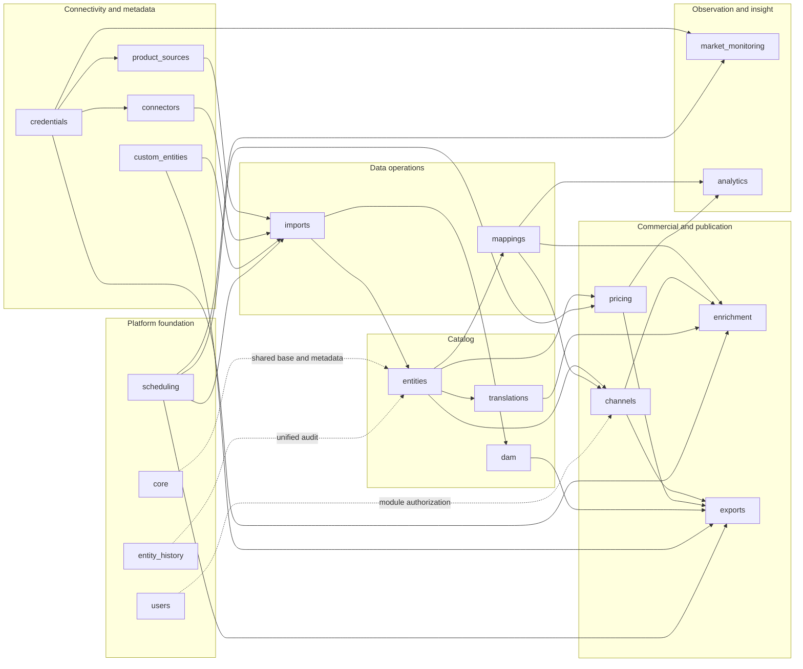

# Backend Applications

The backend contains 19 first-party Django applications. This page is the ownership map: use it to decide where behavior belongs, which data an app owns, and which downstream apps rely on its contracts.

## Application inventory

| Group | Django app | Primary responsibility |
| --- | --- | --- |
| Platform | `core` | Shared model/API behavior, API root, entity graph, error contract |
| Platform | `users` | Users, roles, module grants, module registry, navigation visibility |
| Platform | `entity_history` | Unified audit queries across ORM, dynamic rows, and M2M snapshots |
| Platform | `scheduling` | Database-defined schedules and domain handler dispatch |
| Connectivity | `credentials` | Encrypted variables and reusable external connection definitions |
| Connectivity | `connectors` | Domain-neutral database, file, and transport clients |
| Connectivity | `product_sources` | Source identity and stable supplier feed definitions |
| Extensibility | `custom_entities` | Runtime entities, custom fields, PostgreSQL DDL, dynamic row API |
| Catalog | `entities` | Products, models, taxonomies, attributes, stock, warehouses |
| Catalog | `translations` | Locale definitions and translated catalog fields |
| Catalog | `dam` | Asset ingestion, storage, deduplication, and product-asset links |
| Data operations | `imports` | High-volume source loading, validation, upserts, raw snapshots |
| Data operations | `mappings` | Cross-source identity groups and normalized target projections |
| Commercial | `pricing` | Price lists, rules, batch calculations, currencies, VAT |
| Publication | `channels` | Channel setup, assortment selection, locales, price selection |
| Publication | `enrichment` | Copy/AI generation of channel-localized product content |
| Publication | `exports` | Generic entity exports and channel catalog feed artifacts |
| Intelligence | `market_monitoring` | External URL crawling, latest listing state, price observations |
| Intelligence | `analytics` | Saved analytical views and live mapped price comparison |

## Dependency map

The graph shows important runtime dependencies. Platform apps such as `core`, `users`, and `entity_history` apply more broadly than the arrows can conveniently show.

## Platform foundation

### `core`

**Owns:** common model semantics, common DRF behavior, API discovery, entity metadata, and shared error formatting.

- `BaseModel` supplies timestamps, soft-delete managers, restore/purge behavior, and automatically configured model history.
- `CoreModelViewSet` centralizes filters, pagination, history actions, soft-delete administration, and module-key permission integration.
- `ProjectDefaultRouter` and root-link builders expose a discoverable API root.
- The entity graph describes system/custom entities, fields, relations, path validity, and capabilities for generic engines.
- The exception handler returns a consistent problem-details-style JSON error shape.

**Consumed by:** practically every domain app. Generic consumers such as imports and exports depend specifically on the entity graph; resource APIs inherit the model/viewset contracts.

**Code entry points:** `backend/src/core/models.py`, `api.py`, `entity_graph.py`, `routers.py`, and `root_links.py`.

### `users`

**Owns:** the platform RBAC model and the backend module registry.

- Django users authenticate; Django groups act as roles. A user normally belongs to one role.
- `GroupModuleGrant` stores read/write permissions for stable module keys.
- `UserNavHiddenModule` stores a user's navigation preference and never grants access.
- `ModuleRBACPermission` enforces safe-method versus mutation access at the API boundary.
- The registry exposes static module definitions and dynamic `custom-data-{code}` entries for permission administration.
- `/auth/me` returns the effective module-access map and hidden navigation keys used to compose the frontend.

**Consumed by:** all protected API views and the frontend app shell/module registry. See [RBAC](./rbac) and [Module Registry](./module-registry).

### `entity_history`

**Owns:** normalized audit queries across multiple physical history mechanisms.

- Global history merges migration-backed ORM history, dynamic custom-row history, and M2M snapshot history.
- Entity feeds scope the same contract to a module/resource.
- Record history is exposed alongside ordinary resource APIs.
- Cleanup tasks apply the configured retention window.

**Consumed by:** the administration history explorer, resource detail views, and support investigations. It reads history generated by `core`/`simple_history` and custom-entity M2M writers rather than owning business tables.

### `scheduling`

**Owns:** domain-neutral schedule definitions and dispatch.

- `ScheduledTask` stores a stable code, handler key, JSON config, cron expression, timezone, and active state.
- A synchronization service mirrors active definitions into `django-celery-beat` periodic tasks.
- `dispatch_scheduled_task` loads the current row and invokes a handler registered by a domain app.
- Domain apps register stable handler keys in `AppConfig.ready()`.

Current handlers:

| Handler key | Owner | Meaning |
| --- | --- | --- |
| `imports.run_profile` | `imports` | Execute an import profile |
| `imports.cleanup` | `imports` | Remove import operational data according to policy |
| `pricing.recalculate_price_type` | `pricing` | Recalculate one target price type |
| `pricing.recalculate_price_group` | `pricing` | Recalculate a configured group |
| `market_monitoring.run_source` | `market_monitoring` | Crawl one active market source |
| `exports.run_profile` | `exports` | Execute an export profile |

The scheduler knows how and when to dispatch; the owning domain app validates config and performs the work.

## Connectivity and extensibility

### `credentials`

**Owns:** encrypted reusable external configuration.

- A credential is either a variable or a connection.
- Variables store encrypted scalar values.
- Connections separate non-secret `config` from encrypted `secrets` and track test outcomes.
- Connection types cover relational databases, files/transports, HTTP/API configuration, proxy use, and supported AI providers.
- Test and model-list endpoints give operators a consistent setup workflow.

**Consumed by:** product sources/imports, market monitoring proxy configuration, and AI enrichment. Domain apps reference a credential connection instead of copying secrets into profiles.

### `connectors`

**Owns:** domain-neutral clients that can connect, test, list metadata, stream rows, or access files.

- PostgreSQL and MySQL clients provide database access.
- CSV and FTP/FTPS clients provide file-oriented access.
- Connectors do not interpret products, prices, or other PAD domains.
- Credential factories construct the correct connector from encrypted connection data.

**Consumed by:** imports and connection testing. The import engine decides which query/file is a source and what its columns mean.

### `product_sources`

**Owns:** stable origin identity for catalog data.

- `Source` is the business origin used on source-aware entities such as Product, Category, and Brand.
- `SupplierFeed` binds a source to a credential connection and source configuration.
- Supplier feeds carry stable raw dataset/table identity used by supplier-mode imports.
- Source/feed codes become immutable once their raw tables exist so imported lineage remains interpretable.

**Consumed by:** imports, catalog entities, mappings, and channel supplier priority.

### `custom_entities`

**Owns:** metadata-driven schema extensions and their data API.

- `EntityDefinition` and `FieldDefinition` describe an entirely custom entity.
- `CustomFieldDefinition` extends a supported system table.
- The schema manager executes validated PostgreSQL DDL for data/history tables, columns, indexes, foreign keys, one-to-one relations, and M2M junction tables.
- Runtime unmanaged Django models expose dynamic rows through `/api/v1/custom-entities/data/{code}/`.
- Dynamic entities participate in RBAC, history, soft delete, the entity graph, imports, exports, and frontend module discovery.
- Privileged physical purge removes the schema objects associated with deleted definitions.

The app owns schema lifecycle. Consumers use definitions and entity-graph descriptors instead of issuing DDL themselves.

## Catalog

### `entities`

**Owns:** the PIM/catalog core.

The main aggregates are:

- source-aware products, categories, and brands;
- category trees, brand sets, attribute sets/groups/options;
- families, family attributes, variants and variant axes;
- product models and products;
- product/category and product/brand projections;
- product/model attribute values and selected options;
- warehouses and product stock.

`Product` is identified by source lineage (`source + source_key`) and can carry SKU, family/model, source classifications, and normalized classification projections. It is the central input to mapping, pricing, channels, enrichment, DAM, analytics, and exports.

### `translations`

**Owns:** locales and translated catalog fields.

Translation models cover products, product models, families/variants, category trees/categories, brand sets/brands, and attribute structures. Each row links one target to one locale and stores the localized fields relevant to that entity, including SEO fields where supported.

**Consumed by:** the administration UI, channel content fallback, enrichment input construction, and channel export assembly.

### `dam`

**Owns:** durable digital assets and import-driven media ingestion.

- Import media mappings identify which imported fields contain asset URLs and how they attach to target products.
- A `MediaIngestionRun` is associated with an import run; scopes and items make large downloads observable and resumable.
- Workers claim chunks with `SKIP LOCKED`, stream and validate content, write to local or S3 storage, then transactionally link the asset to a product.
- Unchanged URLs reuse existing assets; reconciliation archives missing links only after replacement work succeeds.
- Product assets remain attached to concrete source products.

**Triggered by:** successful product import stages. **Consumed by:** catalog UI and channel/product feed exports.

## Data operations

### `imports`

**Owns:** generic high-volume loading into system and custom entities.

- Profiles define source connection/feed, targets, field mappings, preprocessing, lookup policies, identifiers, write strategies, and missing-record behavior.
- Simple mode reads a direct connection. Supplier mode reads a `SupplierFeed` and manages a stable per-feed raw snapshot.
- Runs snapshot profile configuration and persist per-target results, issues, and artifacts.
- Dependency planning orders entity writes; FK policies support error, nullable, create, and fallback behavior.
- CSV/database rows are normalized with explicit Polars preprocessing, loaded by PostgreSQL `COPY`, validated set-wise, and upserted set-wise.
- A run performs blocking validation before business-table changes. Successful writes and supplier raw-snapshot swap are atomic; dry-run performs the pipeline without committing those changes.
- Product imports can stage DAM work after the catalog transaction.

**Reads:** credentials/connectors, product sources, custom-entity and entity-graph metadata. **Writes:** selected catalog/custom targets and operational run tables.

### `mappings`

**Owns:** cross-source product identity and normalized classification projection.

- Mapping definitions select participating sources and a published JSON ruleset.
- Runs snapshot rules, build candidates, apply normalization/compatibility/ambiguity/constraint logic, and persist groups/members/conflicts.
- Manual positive, negative, and exclusion overrides have explicit precedence.
- Engines include an in-memory Python path and a hybrid DuckDB + union-find path for larger worksets.
- Mapping groups express product equivalence without creating a new master product.
- The target subsystem projects normalized brands/categories through target assignments and materializes them into product classification relations.

**Consumed by:** channel representative selection, mapped-sibling enrichment, cross-source price analytics, and product-feed offer grouping.

## Commercial and publication

### `pricing`

**Owns:** currency/VAT metadata, price lists, calculation rules, and result application.

- `PriceType` is the common abstraction for any logical price list.
- `ProductPrice` stores source-of-truth values for products.
- Rules derive a target price type using a restricted conditions/formula DSL, currencies, VAT, rounding, constraints, stock, custom fields, and projections.
- DuckDB performs batch calculation over data selected from PostgreSQL.
- Preview runs persist calculated snapshots and diagnostics. Apply replaces rule-generated target rows atomically.
- Recalculation groups and scheduling handlers support repeatable automated refresh.

**Consumed by:** channels/exports and analytics. Channels select price types; pricing owns calculation.

### `channels`

**Owns:** publication context and assortment selection.

- A channel can select category, brand, and attribute structures.
- Scope rules include/exclude products by brand, category, SKU, and stock conditions.
- Channel locales and price types define the output contexts; one active default is enforced for each.
- Assortment synchronization combines scope rules with mapping groups and supplier priority to select one representative product per group.
- It creates/unarchives/archives `ProductChannelEnrichment` rows per locale while preserving authored content.
- Effective classification resolution follows manual target assignment, mapped projection, then source product classification.

**Consumed by:** enrichment and channel exports. **Reads:** catalog, mappings, translations, and pricing selection metadata.

### `enrichment`

**Owns:** controlled generation and application of channel content.

- Configurations select an AI credential/model, instructions/prompts, input fields, target fields, and generation parameters.
- Runs snapshot configuration, channel, locale, operation, selection, target fields, apply mode, and budget information.
- `copy_original` selects the first non-empty field across mapped siblings using channel supplier priority and translations.
- `ai_generate` calls supported Gemini, OpenRouter, or OpenAI providers through a common provider boundary.
- Immediate mode writes results during execution. Review mode stores generated results on run items and applies approved selections later.
- The dedicated `enrichment` queue isolates provider latency and token-intensive work.

**Writes:** `ProductChannelEnrichment` content fields and `last_fill_method`. **Reads:** channel scope, catalog/translations, mappings, credentials.

### `exports`

**Owns:** export profiles, execution, diagnostics, and artifacts for two export domains.

1. **Entity export** uses the entity graph to stream a selected entity with exact filters, ordering, limits, and a flat CSV contract.
2. **Product feed export** assembles channel-specific catalog data from assortment/content, prices, stock, attributes, assets, custom fields/relations, and optional auxiliary custom entities. Current adapters include NDJSON and a CSV bundle.

Profiles maintain available/selected/required field contracts. Preflight diagnostics detect field drift before execution. Runs persist snapshots, issues, counters, and one or more artifacts. The scheduling registry exposes `exports.run_profile`.

## Observation and insight

### `market_monitoring`

**Owns:** collection of external market observations from explicit product URLs.

- `MarketSource` defines host, extraction config, request config, fetch strategy, proxy credential, schedule, and source health.
- `MarketListing` stores one source URL, stable extracted fields, latest price/availability, timestamps, and crawl health.
- Crawl runs freeze source/request/extraction configuration and listing ids, split them into persisted batches, and dispatch batches on the `scraping` queue.
- Fetch strategies progress through configured HTTP, browser, and stealth behavior; source selectors take precedence over JSON-LD/meta fallbacks.
- Successful observations update latest listing state. Changed price/availability with a numeric price writes `MarketPriceHistory`.
- Failures preserve the last successful business values while updating crawl status and grouped issues.

The module does not match market listings to internal products. It owns observation, not catalog identity resolution.

### `analytics`

**Owns:** reusable analytical view definitions and live price-comparison queries.

- `SavedAnalysisView` stores validated owner/shared configuration rather than cached analytical output.
- Comparison legs select source, price type, and currency.
- Same-source comparisons join product prices directly.
- Cross-source comparisons use active members of the selected mapping definition to compare equivalent source products.
- Category/brand filters, summary statistics, density, and distribution are computed against current PostgreSQL data.

**Reads:** products/classification, mappings, price types, product prices, and currency metadata. It does not write calculated prices.

## How to choose the owning app

Use these tests when a change crosses boundaries:

| Question | Owner |
| --- | --- |
| Is this the meaning or persistence of catalog data? | `entities` or `translations` |
| Is this how external bytes/rows are accessed? | `connectors`; secret/config lifecycle belongs to `credentials` |
| Is this how source rows become platform rows? | `imports` |
| Is this equivalence or normalized classification? | `mappings` |
| Is this a calculated price value or rule? | `pricing` |
| Is this which product/content/price appears in a publication context? | `channels` or `enrichment` |
| Is this file/feed construction? | `exports` |
| Is this external website observation? | `market_monitoring` |
| Is this generic authorization/history/schema metadata? | the relevant platform app |

Cross-app orchestration should call the owning app's service boundary and persist its own run state rather than duplicating another app's rules.
