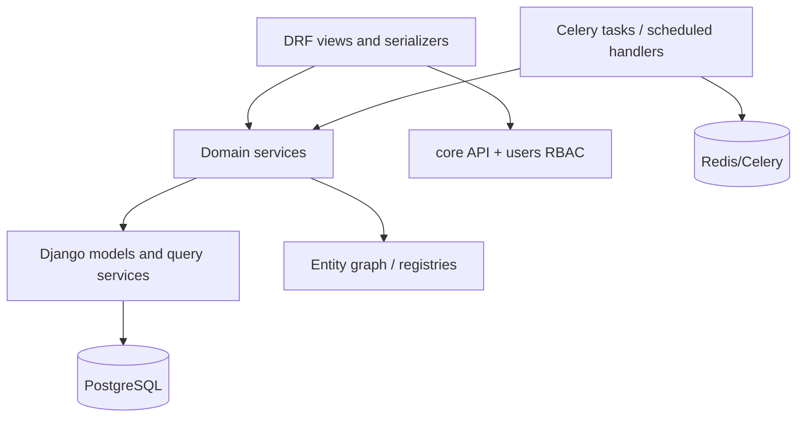
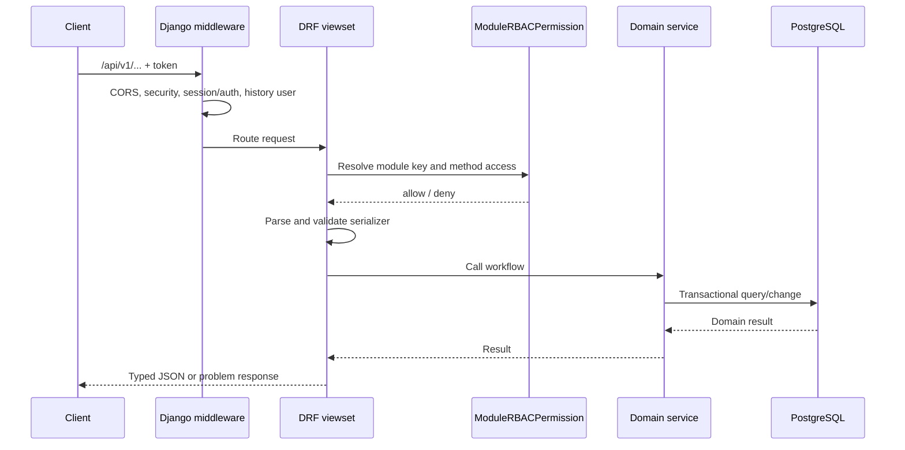
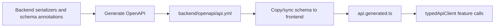

# Backend Architecture

The backend is a Django/DRF modular monolith. PostgreSQL is the system of record, Redis transports Celery work, and specialized workers execute long-running or dependency-heavy workflows. Domain code is separated by Django app, while shared platform contracts live in `core`, `users`, `entity_history`, and `scheduling`.

## Code organization

```text
backend/
├── manage.py
├── openapi/api.yml              # committed HTTP contract
├── src/
│   ├── settings.py              # Django, DRF, Celery and storage configuration
│   ├── urls.py                  # top-level API routing
│   ├── celery.py                # Celery application
│   ├── core/                    # shared model/API/entity-graph contracts
│   ├── users/                   # RBAC and module registry
│   ├── scheduling/              # handler-based schedules
│   └── <domain_app>/            # models, API, services, tasks, tests
└── docs/                        # backend-specific implementation notes
```

A domain app typically contains:

| Layer | Responsibility |
| --- | --- |
| `models.py` | Durable domain state, constraints, indexes, and relations |
| `serializers.py` | HTTP validation/representation and OpenAPI-visible schemas |
| `views.py` / `api.py` | Authorization boundary, request orchestration, actions, query optimization |
| `services/` | Reusable business workflows, domain algorithms, transaction boundaries |
| `tasks.py` | Celery entry points that load a durable id and call domain services |
| `handlers.py` | Scheduling adapters from a `ScheduledTask` to domain work |
| `apps.py` | Startup-time registration of handlers or other metadata |
| `tests/` | Unit, service, API, task, and cross-contract tests |

The complete app ownership list is in [Backend Applications](./backend-applications).

## Dependency direction



Views translate HTTP into domain inputs and enforce access. Tasks translate a queued durable id into domain execution. Business rules belong in services so the same operation behaves consistently from API, schedule, test, or another app.

Cross-app code should depend on the owner app's service/query contract or stable model relation. It should not reproduce another app's rules in a serializer or task.

## HTTP request lifecycle



### Shared API behavior

`CoreModelViewSet` is the standard resource boundary. It brings together:

- module-key RBAC;
- filter/search/order/pagination conventions;
- soft-delete administration actions;
- record-history actions;
- shared serializer and exception behavior.

Resources with special workflows add explicit DRF actions or dedicated API views while retaining the same authorization and error contracts.

## Model foundation

`ModelWithDates` provides creation/update timestamps. `BaseModel` adds soft deletion and default/all/deleted managers. Its metaclass configures `django-simple-history` with stable `history_{app}_{model}` table names for migration-backed models.

The model layer also encodes database truth:

- uniqueness and conditional uniqueness;
- protective versus cascading relations;
- indexes for supported query paths;
- explicit database table names;
- check constraints where a rule must hold independently of the API.

Dynamic custom rows use runtime unmanaged models but follow the same logical contracts for soft deletion and history. See [Soft Delete](./soft-delete) and [History](./history).

## API contract and schema generation

The committed OpenAPI document is the source of truth between backend and frontend.



Rules for an API change:

1. Express request/response fields, custom actions, enums, and JSON DSL shapes in backend serializers/schema components.
2. Regenerate and commit `backend/openapi/api.yml`.
3. Sync the document and regenerate `frontend/src/shared/types/api.generated.ts`.
4. Use generated transport types in frontend feature code; create handwritten types only for UI/view state that differs from transport data.
5. Run backend schema checks and frontend type/build verification.

The detailed commands are in [API Sync](../engineering/api-sync).

## Entity graph and registration

The entity graph is a runtime catalog derived from registered DRF resources, Django model metadata, and custom-entity definitions. It gives generic engines stable metadata without requiring each engine to maintain a handwritten entity list.

Apps may register behavior during `AppConfig.ready()` when the registration is declarative and idempotent. Scheduling handlers use this path. The entity graph lazily inspects router registrations and caches descriptors per process; custom-schema signals invalidate the relevant cache.

See [Entity Graph](./entity-graph) for the descriptor and path-validation contracts.

## Transactions and durable runs

Short resource writes use normal database transactions. Long-running workflows follow a durable-run pattern:

1. Validate operator input synchronously.
2. Create a run row and copy mutable configuration into `config_snapshot`.
3. Commit the run before dispatching work.
4. Queue only durable identifiers, not full domain objects or secret payloads.
5. Let workers claim pending work idempotently.
6. Persist counters, child states, issues, and final outputs.
7. Finalize status and timestamps in a transaction.

This pattern supports retries and inspection without keeping an HTTP transaction open. Domain-specific examples are documented in [Runtime Data Flows](./runtime-data-flows).

## High-volume execution paths

The backend uses different execution techniques according to workload shape:

| Technique | Used for | Reason |
| --- | --- | --- |
| PostgreSQL `COPY` + set-based SQL | Imports | Avoid row-by-row ORM overhead and validate/upsert whole batches |
| Polars preprocessing | Imports | Explicit, vectorized source transformations before database load |
| DuckDB | Pricing and large mapping candidates | Efficient analytical/batch computation over extracted worksets |
| Union-find | Mapping groups | Efficiently produce connected identity components |
| `SELECT ... FOR UPDATE SKIP LOCKED` | DAM ingestion claims | Multiple workers safely claim independent item chunks |
| Streaming serialization/files | Exports | Bound memory usage for large output datasets |
| Persisted batch ids | Market crawling | Stable worksets and independent parallel batch execution |

PostgreSQL remains the durable source of truth even when an in-process analytical engine performs a calculation.

## Background execution

Celery autodiscovers app tasks. Central settings route dependency-specific work:

- market crawl run/batch tasks to `scraping`;
- enrichment execution to `enrichment`;
- DAM ingestion to `media`;
- all other tasks to the default queue unless deployment configuration overrides routing.

Celery Beat uses `django-celery-beat`'s database scheduler. PAD `ScheduledTask` rows provide the domain-facing schedule contract; a sync service maintains the corresponding periodic task and the dispatcher resolves a domain handler key at runtime.

Task functions remain thin. They load the run or domain object, handle missing/cancelled states, call services, and finalize observable status.

## Errors, diagnostics, and audit

Three mechanisms answer different questions:

| Mechanism | Question answered |
| --- | --- |
| API problem response | Why did this request fail now? |
| Domain run issue/error rows | Which records/stages failed during this bulk execution, and why? |
| History | Who changed a durable model record, what changed, and when? |

Bulk engines persist aggregated issues and representative samples to keep diagnostics useful at scale. High-volume replacement operations such as calculated price application use domain runs/errors as their audit record instead of generating per-row generic history entries.

## Adding or changing backend behavior

1. Identify the owning app using [Backend Applications](./backend-applications).
2. Put invariants in models/database constraints and reusable workflow rules in services.
3. Keep views/tasks as adapters around those services.
4. Assign or reuse a stable module key and enforce `ModuleRBACPermission` at every resource/action boundary.
5. Register the resource with the project router so API discovery and entity-graph metadata stay coherent.
6. Describe the full HTTP contract, regenerate OpenAPI, and regenerate frontend types.
7. Add tests at the lowest useful layer plus API/task coverage for authorization and lifecycle behavior.
8. Update the relevant architecture page when ownership, a cross-app contract, or a runtime flow changes.
