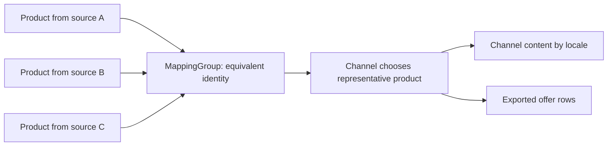
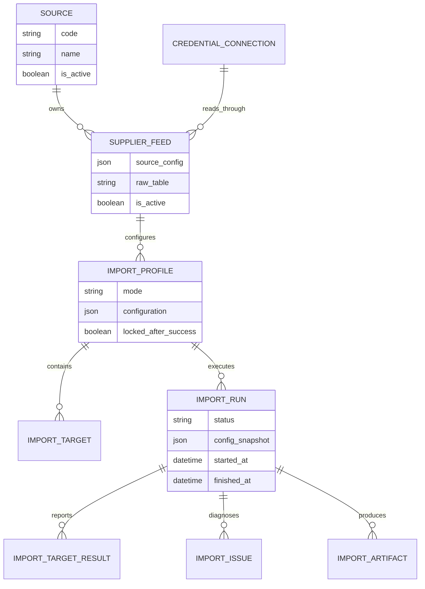
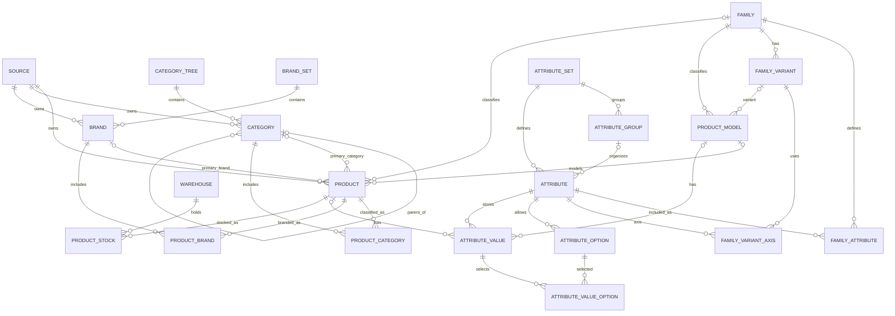
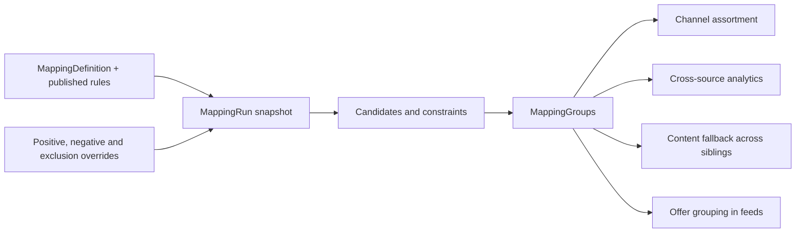
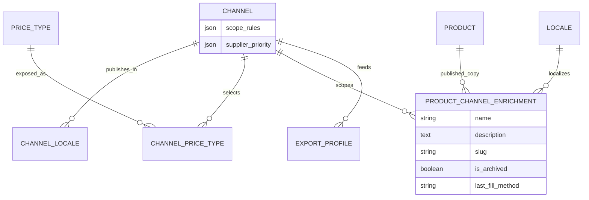
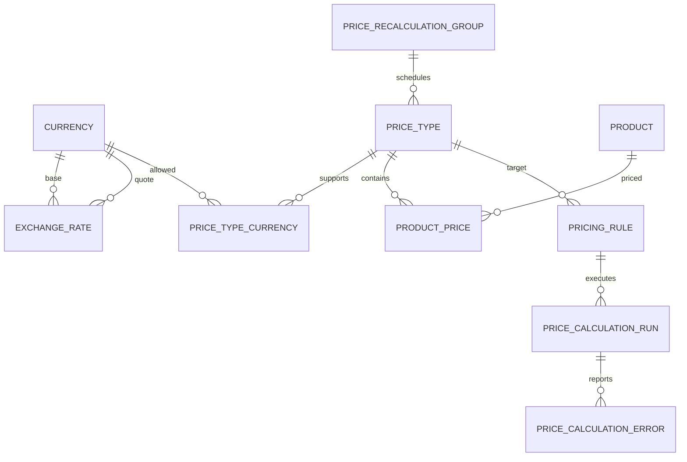
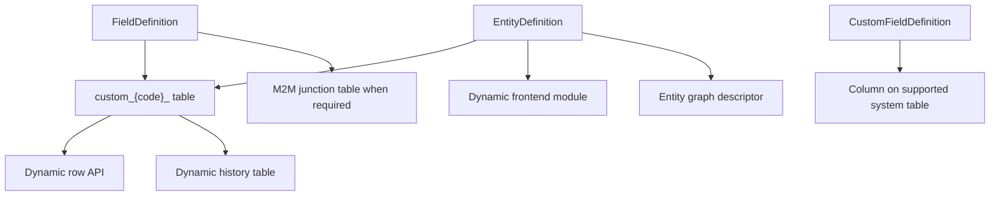

# Domain Model

This page is the conceptual model of PAD Platform. It explains what the central records mean and which records must not be treated as interchangeable.

## Core mental model

| Concept | Meaning |
| --- | --- |
| `Source` | A business origin for catalog data, usually a supplier or internal source system |
| `SupplierFeed` | A concrete extract from a source, bound to a credential connection and a stable raw dataset identity |
| `Product` | A source-specific sellable record identified by `source + source_key`; it remains owned by that source |
| `ProductModel` | A model-level record within the catalog hierarchy; attribute values can belong to a product or product model |
| `MappingGroup` | A set of source records considered equivalent by a published mapping run |
| `MappingTarget` | A normalized classification target, such as a canonical brand or category projection |
| `Channel` | A publication context with assortment rules, locales, price types, and catalog projections |
| `ProductChannelEnrichment` | Channel-and-locale-specific publishable copy for one product |
| `PriceType` | A logical price list; manual, imported, supplier, competitor, channel, and calculated prices use the same abstraction |
| `MarketListing` | A monitored external product URL and its latest observed market state; it is not an internal product |
| Run record | A durable execution instance with a configuration snapshot, lifecycle state, counters, and diagnostics |

The most important distinction is:

A mapping group records equivalence. It does not create or own a separate golden product row. The original products remain available for supplier-specific stock, prices, assets, attributes, and content.

## Source and import identity

`Source` is business identity; `CredentialConnection` is connection technology and secrets; `SupplierFeed` joins them into a repeatable dataset. Supplier-mode imports preserve a stable raw-table identity so a successful run can atomically replace the previous snapshot and calculate missing-record behavior against it.

An import profile describes how source fields become target fields. An import run captures the actual profile configuration used for one execution. This prevents later profile edits from changing the meaning of an earlier run.

## Catalog model

The catalog supports both scalar convenience relations (`Product.category`, `Product.brand`) and explicit many-to-many projections (`ProductCategory`, `ProductBrand`). Mapping target publication writes normalized brand/category projections into the junction tables while preserving source classifications.

Attribute values may be localized or channel-specific and may belong to a product or product model. Families define which attributes apply; variants define which attributes act as axes.

## Identity resolution and classification projection

The mappings application owns two related but different outputs.

### Product identity groups

`MappingDefinition` selects sources and rules. A `MappingRun` snapshots those rules and produces `MappingGroup` and `MappingGroupMember` rows. The engine uses eligibility, normalization, candidate generation, compatibility/rejection rules, ambiguity resolution, constraints, and manual overrides.

### Normalized targets

`MappingTarget` and `MappingTargetAssignment` project source classifications into normalized brand/category values. Manual assignments override mapped projections; source product classifications remain the fallback for channel behavior.

Identity groups answer “which source products represent the same thing?” Target projections answer “which normalized classification should this source value use?”

## Channel publication model

A channel is a publication context, not a copy of the catalog. Assortment synchronization evaluates scope rules and uses mapping groups plus `supplier_priority` to choose a representative source product. It creates or unarchives an enrichment row for every active channel locale and archives rows that leave scope. Existing content is preserved across synchronization.

Content fields live on `ProductChannelEnrichment`, separate from source/base data. They can be filled manually, copied from the best available mapped sibling, or generated by an AI enrichment run. `is_archived` expresses assortment membership; field completeness is calculated from actual content.

## Pricing model

`PriceType` is the stable abstraction for a price list. A `ProductPrice` stores one product value for a price type/currency context. `PricingRule` derives a target price type from other prices and product data using a restricted condition/formula DSL. A preview run stores calculated results; applying it atomically replaces rule-generated target values.

Channels select price types. They do not own price calculation logic.

## Translations, enrichment, and assets

- `translations` stores locale-specific fields for catalog taxonomies, products, models, families, and variants.
- `enrichment` orchestrates copy-from-base and AI generation into `ProductChannelEnrichment`; configuration and every run are snapshotted.
- `dam` stores deduplicated assets and links them to concrete source products. Import media mappings create ingestion work after a successful product import.

Assets remain tied to concrete products. Mapping groups can inform downstream selection, but DAM does not move asset ownership to a synthetic master product.

## Market observation and analytics

`MarketSource` describes one external website and extraction/request strategy. `MarketListing` represents one explicit URL, its latest extracted fields, and crawl health. `MarketPriceHistory` records numeric observations when price or availability changes. Crawl runs split listing ids into persisted batches and group issues by stage and code.

Market listings are deliberately separate from internal products. Market monitoring collects observations; identity matching belongs to a separate business workflow.

Analytics stores reusable `SavedAnalysisView` configuration and computes results from live product prices. Same-source comparisons join product prices directly. Cross-source comparisons intersect products through active mapping groups.

## Custom schema model

Custom entity definitions are metadata backed by real PostgreSQL tables created through validated DDL. Runtime unmanaged Django models expose the rows through a generic API. Custom fields extend supported system tables and appear in the module registry and entity graph like ordinary fields.

## Repeating operational pattern

Most high-volume workflows use the same observable shape:

| Layer | Purpose | Examples |
| --- | --- | --- |
| Definition/profile | Reusable operator configuration | ImportProfile, MappingDefinition, PricingRule, ExportProfile |
| Run | One execution with snapshot and lifecycle | ImportRun, MappingRun, PriceCalculationRun, EnrichmentRun, MarketCrawlRun, ExportRun |
| Item/result | Per-target or per-record progress | ImportTargetResult, EnrichmentRunItem, MarketCrawlBatch |
| Issue/error | Actionable diagnostics | ImportIssue, MappingConflict, PriceCalculationError, MarketCrawlIssue, ExportRunIssue |
| Artifact/output | Durable result | ImportArtifact, ExportArtifact, MappingGroup, ProductPrice, channel enrichment rows |

This pattern is the preferred mental model for tracing asynchronous behavior: begin with the run, inspect its snapshot, then its counters, items/issues, and final output.
