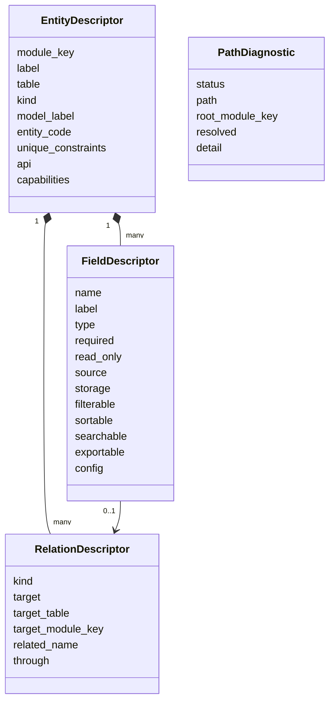
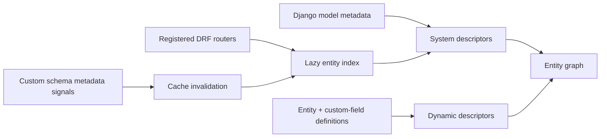
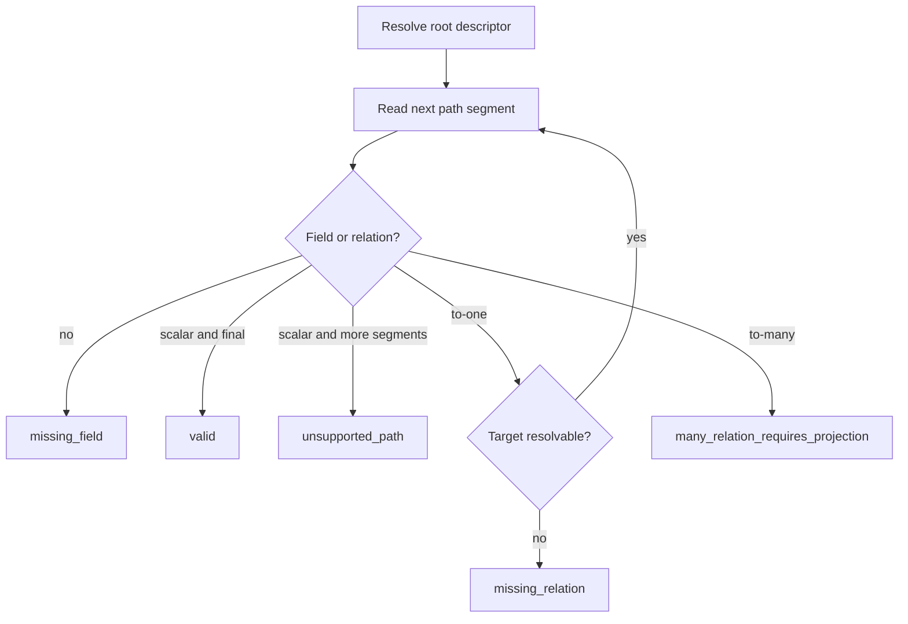

# Entity Graph

The entity graph is the backend's descriptive catalog of available entities, fields, relations, uniqueness, API metadata, and capabilities. Generic engines consult it before building their own data access or projection logic.

It is metadata-only: it does not read business rows, execute a query language, calculate values, or choose how a many-valued relation should be projected.

## Public service contract

`backend/src/core/entity_graph.py` exposes:

| Function | Result |
| --- | --- |
| `describe_entity(target)` | Resolve a model, table, module key, or supported target to one descriptor |
| `list_entities()` | Return all discovered system and custom descriptors |
| `get_entity(module_key)` | Resolve by stable module key |
| `validate_path(root, path)` | Validate a dotted field/relation path without reading data |
| `to_target_dict(descriptor)` | Serialize into the target shape used by imports and its UI |
| `register_router(router)` | Add DRF router resources to discovery |
| `invalidate()` | Clear process-local descriptor caches after metadata changes |

HTTP endpoints expose the catalog under `/api/v1/entities/`, including a list and a module-key detail resource.

## Descriptor shape

Field `source`/`storage` explain where a field originates and how it is represented. Relation descriptors preserve cardinality, target identity, reverse name, and through-table information. Unique constraints let import/export/configuration UIs reason about stable identifiers.

## Discovery

Apps register their routers during `AppConfig.ready()`. The graph reads each viewset's resource/module key and model, then derives fields, relations, constraints, API metadata, and capabilities. Custom entities are indexed as `custom-data-{code}` and include custom fields plus reverse custom relations.

Descriptors are cached per process after first use. Definition/field changes invalidate the cache so workers and API processes rebuild from current metadata.

## Path validation

Consumers validate dotted paths before they compile SQL, extract values, or configure a field mapping.

| Status | Meaning | Consumer response |
| --- | --- | --- |
| `valid` | Every segment exists and scalar/to-one traversal is supported | Compile the consumer-specific resolver |
| `missing_field` | No field or reverse relation exists at the current segment | Reject configuration with the diagnostic detail |
| `missing_relation` | A relation exists but its target cannot be described | Reject and surface the unresolved relation |
| `many_relation_requires_projection` | Traversal reaches one-to-many or many-to-many | Require an explicit consumer projection such as count, first, filter, or explode |
| `unsupported_path` | Root is unknown, a scalar is traversed, or call/index/mapping syntax is used | Reject the path syntax/shape |

The graph deliberately stops at the many-valued boundary. Imports, pricing, and exports have different valid projection semantics and must choose them explicitly.

## Consumers

| Consumer | How it uses the graph |
| --- | --- |
| Imports | Lists valid targets/fields, constraints and relations; validates mapping paths and dependency planning inputs |
| Exports | Builds available field contracts and resolves exact entity selections/relations |
| Pricing | Validates product/custom field paths before building calculation inputs |
| Custom entities | Publishes dynamic entities, fields, relations, tables, and capabilities into the common catalog |
| History/administration | Resolves module/resource identity around system and dynamic models |
| Frontend configuration screens | Receives serialized target/field metadata through backend APIs |

Each consumer owns value resolution, permission checks, query limits, filters, and projection behavior. A valid graph path proves structural existence, not that a particular record has a value.

## System and custom relation integration

Custom metadata appears in both directions:

- a custom entity descriptor contains its scalar and relation fields;
- a custom field on a system table appears on that system entity;
- reverse custom relations appear on their target descriptor with target module/table metadata;
- M2M relations include the junction/through identity required by writers and history.

This makes generic imports and exports operate across static and dynamic schema through one descriptor model.

## Engineering rules

- Register a new resource router so discovery can see it; do not hardcode it in each consumer.
- Keep module keys and target tables stable because configurations persist those identities.
- Add consumer-specific virtual/business fields in the consumer's contract unless they represent real shared entity metadata.
- Call `validate_path()` before compiling access; do not treat string paths as trusted SQL or Python expressions.
- Invalidate the graph whenever schema metadata changes.
- Update this page when descriptor or path-diagnostic semantics change.

