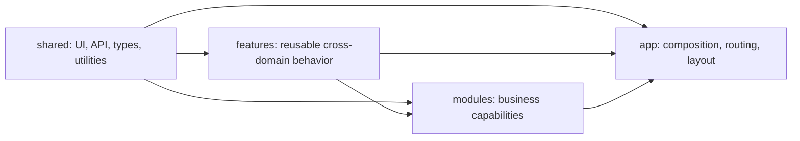
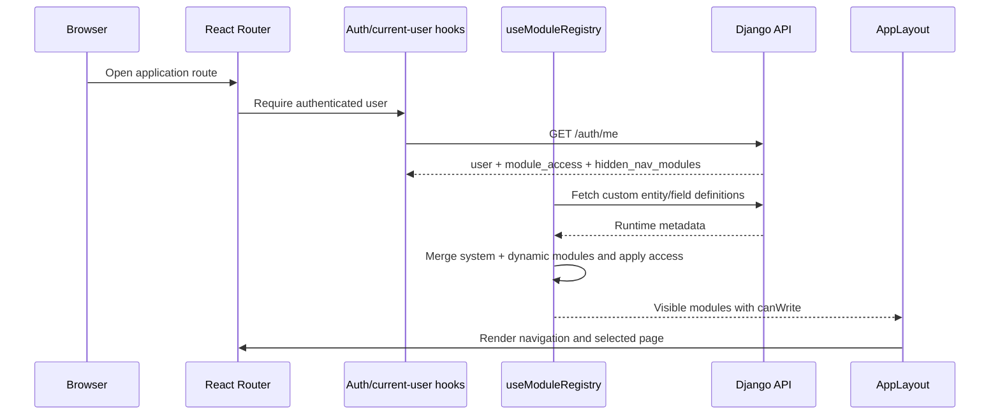
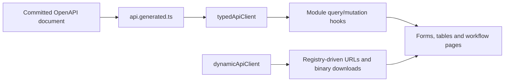

# Frontend Architecture

The frontend is a React/TypeScript administration application. It combines static feature modules with backend-defined custom entities, filters them through the current user's module access, and renders either reusable CRUD screens or purpose-built workflow pages.

## Code direction



The practical dependency rule is `shared → features/modules → app`:

- `shared` must not import business modules or app composition.
- reusable `features` can depend on shared infrastructure and define cross-module UI behavior such as entity CRUD.
- business modules own their manifests, API calls, and custom pages.
- `app` is the composition root that imports modules, supplies providers, builds navigation, and owns top-level routing.

Business modules should communicate through shared contracts or backend APIs rather than importing implementation details from sibling modules.

## Directory map

```text
frontend/src/
├── app/
│   ├── layouts/                 # authenticated shell
│   ├── navigation/              # user-facing information architecture
│   ├── providers/               # query, theme and router providers
│   ├── registry/                # system + dynamic module composition
│   └── router/                  # explicit and generic routes
├── features/
│   └── entity-crud/             # reusable list/detail/form route renderer
├── modules/
│   └── <feature>/               # manifest, API hooks, pages and components
└── shared/
    ├── lib/api/                 # typed and dynamic API client boundaries
    ├── types/api.generated.ts   # generated OpenAPI transport types
    └── ...                      # shared UI/hooks/utilities
```

## Frontend module inventory

| Module folder | Responsibility |
| --- | --- |
| `administration` | Users, groups/roles, permission matrix, credentials, history administration |
| `analytics` | Saved analysis views and price comparison workflows |
| `auth` | Login, token lifecycle, current-user query, auth guards |
| `catalog` | Catalog overview, system entity modules, field configuration |
| `channels` | Channel, locale, price selection, assortment/content workflows |
| `credentials` | Credential variables/connections and connection tests |
| `custom-entities` | Dynamic entity and field definition management |
| `dam` | Assets, ingestion runs, scopes and item inspection |
| `dashboard` | Product entry point and summary surface |
| `enrichment` | Configurations, run creation, progress, review and apply |
| `exports` | Profiles, preflight, runs, issues and artifact access |
| `imports` | Profiles, mappings, run execution, issues and artifacts |
| `mappings` | Definitions, runs, groups/conflicts, target projection workflows |
| `market-monitoring` | Sources, listings, crawl runs, previews and diagnostics |
| `pricing` | Price metadata, values, rules, preview/apply, analytics entry points |
| `settings` | Personal application settings and keyboard shortcuts |
| `translations` | Locale and translated-entity administration |

Several folders provide custom pages without contributing a system module manifest directly. System manifests are composed from the domain modules that expose registry-driven routes.

## Application startup and composition

`AppProviders` creates the query client, theme provider, and router provider. `RequireAuth` protects the app shell. `AppLayout` composes navigation, global actions, and the routed page.



## Routing model

The router declares purpose-built routes first and generic entity routes last.

Purpose-built routes include:

- dashboard and catalog entry pages;
- custom entity/schema management;
- system custom-field forms;
- mapping definition/run/target detail pages;
- settings and keyboard shortcuts.

Fallback routes `:moduleKey` and `:moduleKey/:recordId` render `EntityRoute`. It resolves the module definition, then chooses the generic list/detail/form presentation or a custom page supplied by the module manifest.

This ordering lets common resources use one CRUD implementation while complex workflows keep deliberate screens and URL shapes.

## Module manifests

A `ModuleDefinition` is frontend presentation and routing metadata, not a handwritten API DTO. A system manifest can define:

- stable route/module key and optional distinct RBAC key;
- label, icon, navigation group, endpoint, and target table/model;
- entity fields and relation display behavior;
- list columns, filters, forms, actions, and custom page components;
- whether the resource supports generic CRUD behavior.

`SYSTEM_MODULES` is the composition root for these manifests. The registry then adds custom-entity modules and custom fields discovered from the backend. See [Module Registry](./module-registry) for the full merge algorithm.

## Navigation versus routing

The navigation schema is the source of user-facing information architecture. It groups pages into:

- Overview;
- Catalog;
- Data operations;
- Content;
- Pricing;
- Channels;
- Market monitoring;
- Administration.

Navigation items reference module keys or explicit routes and are filtered by module availability/access. The module registry decides whether a resource exists for this user; the navigation schema decides where and how it appears. The router decides which page renders.

These are intentionally separate contracts. Moving an item in navigation does not change its API permission or route identity.

## API boundaries and transport types



- `typedApiClient` is the default for schema-known API paths and returns generated transport types.
- `dynamicApiClient` is the centralized boundary for registry-built URLs, custom-entity endpoints, and binary downloads that cannot be expressed as a static OpenAPI path call.
- Direct Axios imports remain inside `frontend/src/shared/lib/api`.
- `VITE_API_URL` configures the base URL; an empty value uses the current origin.

Feature modules may define view models for table/form state, but they must not copy backend request/response DTOs by hand.

## Server state and mutations

TanStack Query owns server-state caching, loading/error states, and invalidation. Module hooks use stable query keys around resource or workflow identity. Mutations invalidate the narrowest relevant queries and let the backend remain authoritative.

Long-running workflows create a run through an API action and then query that run and its children. The UI never assumes a Celery task succeeded because dispatch returned successfully.

Local component state is reserved for presentation concerns such as open dialogs, selection, draft form values, active tabs, or unsaved filters.

## Authentication and authorization in the UI

The frontend stores the authentication token and sends it through the shared client. `RequireAuth` protects routes and `useCurrentUser` loads the effective access model.

For every module, the registry:

1. resolves `rbacKey ?? key`;
2. removes modules without read access;
3. removes modules the user chose to hide from navigation;
4. annotates surviving modules with `canWrite` from the access map.

UI access controls improve navigation and prevent invalid actions, but the backend permission class remains the security boundary. See [RBAC](./rbac).

## Generic CRUD versus custom workflows

Use generic entity CRUD when a resource is primarily list/filter/create/edit/detail behavior described by fields and relations. This keeps tables, forms, permissions, soft-delete administration, and history consistent.

Use a custom page when the workflow requires orchestration or domain-specific interaction, for example:

- import profile mapping and run diagnostics;
- visual mapping definition/run inspection;
- pricing preview and apply;
- enrichment review and selective apply;
- market crawl preview, run metrics, and grouped issues;
- export preflight and artifact handling.

A custom page still uses generated API types, shared query/client boundaries, module access, and the common layout.

## Adding or changing a frontend capability

1. Confirm the backend OpenAPI contract and regenerate transport types first.
2. Choose generic CRUD or a purpose-built workflow based on the interaction, not on app ownership alone.
3. Add or update the owning module's manifest, hooks, components, and pages.
4. Compose a new system manifest through `system-modules.ts` when it creates a registry-driven module.
5. Add its user-facing placement to `navigation-schema.ts`.
6. Add explicit routes before generic `:moduleKey` routes when custom routing is required.
7. Use `rbacKey` when route identity and backend authorization identity differ; never infer permissions from a label or path.
8. Verify read-only and write-enabled roles, hidden navigation, loading/empty/error states, and direct URL access.
9. Update [Module Registry](./module-registry) or this page when composition rules change.

