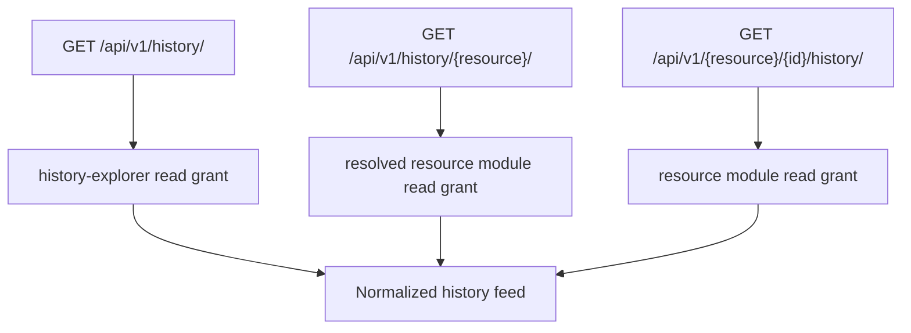
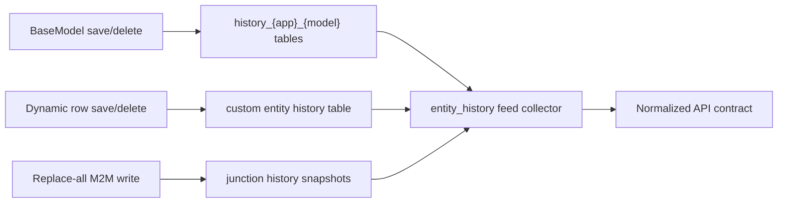
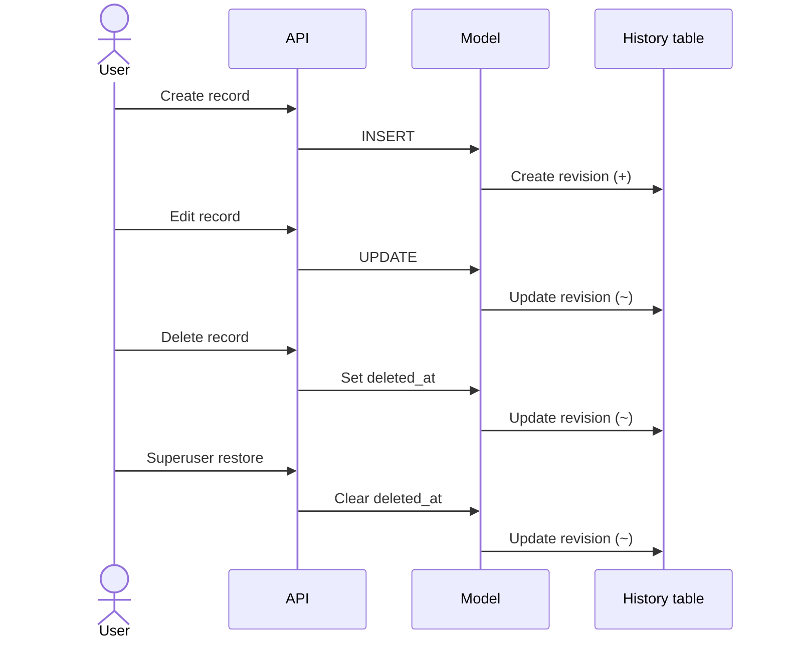

# History and Audit

History answers who changed a durable record, when it changed, and what the recorded state was. PAD exposes one normalized JSON contract across migration-backed Django models, dynamic custom-entity rows, and custom many-to-many junction snapshots.

Domain run records answer a different question: how a bulk operation executed. Both are required to understand the system.

## Normalized history record

Every feed returns the same core fields:

| Field | Meaning |
| --- | --- |
| `history_id` | Identifier inside the physical history source |
| `history_date` | Revision timestamp |
| `history_type` | Create/update/delete revision type from the history mechanism |
| `history_user` | User id, username, and display name when known |
| `history_change_reason` | Optional reason attached to the revision |
| `record_id` | Business record id |
| `model_name` / `model_verbose_name` | Included in entity/global feeds to identify the source |
| `history_kind` | `orm`, `dynamic_row`, or junction snapshot kind |
| `data` | Tracked field values at that revision |

History user attribution is populated through the simple-history request middleware for request-driven changes. Background and set-based operations rely on their domain run/trigger context when no request user exists.

## Three API levels

| Level | Use |
| --- | --- |
| Global | Recent changes across all tracked sources for the administration explorer |
| Entity | Recent changes for one system or dynamic resource slug |
| Record | Complete paginatable change sequence for one record, including soft-deleted records |

All feed levels support/return history user information; global and entity feeds accept `history_user=<Django User PK>` filtering. The default global collector takes up to 15 recent rows from each physical source, merges/sorts them, and returns the latest 150. Entity feeds return up to 100 recent rows per request before API-level response handling.

## Physical history sources

### Migration-backed models

`BaseModelMeta` attaches `HistoricalRecords` and names the table `history_{app}_{model_name}`. Individual model saves, soft deletes, and restores therefore produce revisions with tracked values.

### Dynamic custom rows

The custom-entity factory attaches history to each runtime model using the history table created by the schema manager. Dynamic rows appear in global/entity/record views with `history_kind = dynamic_row`.

### Many-to-many snapshots

Dynamic and custom M2M values live in junction tables and are often written as a replace-all set. The history subsystem records a snapshot for that field/junction operation so the relationship state remains auditable instead of relying on a scalar model revision.

## History versus operational audit

| Change type | Primary evidence |
| --- | --- |
| User edits one product/category/configuration | Model history |
| User soft-deletes/restores a record | Model history, including `deleted_at` state |
| Dynamic M2M selection replaced | Junction history snapshot |
| Import loads thousands of rows | Import run snapshot, target results, issues/artifacts; model history where individual save paths apply |
| Pricing preview/apply replaces calculated prices | PriceCalculationRun, result/error context, and apply status |
| Market website reports a new price | MarketPriceHistory observation and MarketCrawlRun, not generic edit history alone |
| AI content generation | EnrichmentRun and item input/result/previous values plus resulting model history where saved normally |

High-volume engines may intentionally use bulk/set-based writes that do not emit a revision per affected row. Their run, snapshot, diagnostics, and result models are the authoritative operational audit.

## Retention

`SIMPLE_HISTORY_KEEP_DAYS` defaults to 90 days. The history cleanup command/task removes older generic revisions according to that setting. Domain-specific observation and run retention is governed by the owning domain rather than silently sharing generic model-history retention.

## Record lifecycle example

Soft delete keeps the business row and its revision chain. Purge physically removes the row according to database/history library behavior and is therefore an administrative lifecycle action, not ordinary editing.

## Engineering rules

- Use `BaseModel` for ordinary domain models that require the platform lifecycle contract.
- Do not create a second ad hoc audit JSON shape for a normal record feed.
- Preserve request user attribution by keeping history middleware and normal save paths for interactive edits.
- Add domain run/item/issue records for bulk workflows where per-row history would be incomplete or prohibitively large.
- Record custom M2M replace-all changes through the junction snapshot service.
- Keep resource-to-module resolution synchronized so entity history is gated by the correct RBAC key.
- Treat market price observations and calculation/import runs as domain audit, not substitutes for one another.
