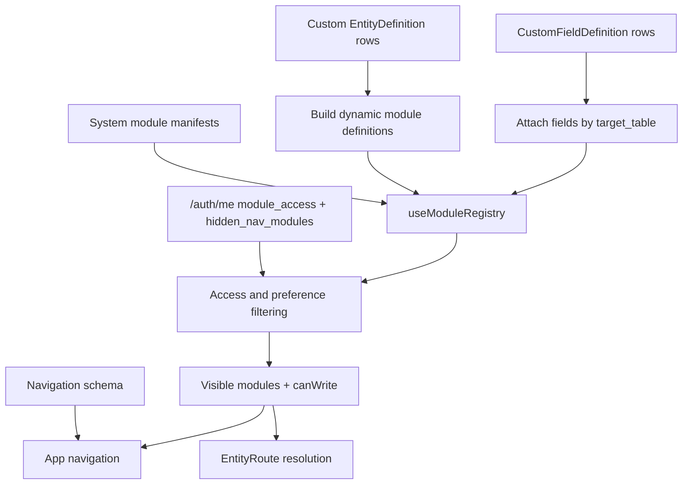
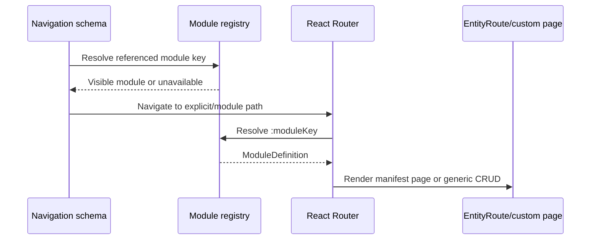

# Module Registry

“Module registry” refers to several cooperating catalogs, not one universal file. Together they connect backend resources, permission keys, frontend presentation, dynamic custom entities, navigation, and routes.

## The four contracts

| Contract | Source of truth | Responsibility |
| --- | --- | --- |
| Backend RBAC registry | `backend/src/users/registry.py` | Which stable module keys can be granted, their administration group/label, and whether write access is meaningful |
| Frontend system modules | Per-domain manifests composed in `frontend/src/app/registry/system-modules.ts` | Route/presentation metadata for implemented system resources |
| Dynamic modules | Backend custom-entity and custom-field definitions | Runtime modules and fields created by operators |
| Navigation schema | `frontend/src/app/navigation/navigation-schema.ts` | User-facing sections, ordering, labels, explicit routes, and shortcuts |

The entity graph is adjacent metadata used by backend engines. It describes data shape, not frontend placement. See [Entity Graph](./entity-graph).

## Runtime composition

The registry query loads custom entity definitions and supported core custom-field definitions. It merges them with static system manifests, resolves relation targets by table, then applies current-user access.

## Module key rules

A module key is a stable machine identifier. It must survive label, icon, navigation, or page-layout changes.

Examples:

- system resources: `products`, `pricing-rules`, `import-runs`, `history-explorer`;
- service/administration surfaces: `users-matrix`;
- custom-entity RBAC: `custom-data-{entity.code}`.

For a dynamic custom entity:

- the frontend route/module `key` is the entity code;
- the authorization `rbacKey` is `custom-data-{code}`;
- the endpoint is `/api/v1/custom-entities/data/{code}/`;
- the target table and fields come from backend definitions.

A system module may also declare a separate `rbacKey` when its route identity differs from the permission surface. Code must always resolve permission as `rbacKey ?? key`.

## Backend RBAC registry

`STATIC_MODULE_DEFS` lists grantable system modules. Each definition contains:

- `key`;
- display label for the access matrix;
- group id and group label;
- `supports_write`.

The registry endpoint appends dynamic custom-data modules and groups everything for the role matrix. Preferred group order affects display only; a definition is never removed because its group is not in that preferred list.

The registry is an allowlist for grant payloads. A grant to an unknown system key is rejected. A `custom-data-*` key is valid only while the corresponding non-deleted entity definition exists.

## Frontend system manifests

Each business module owns the presentation metadata for its resources. `SYSTEM_MODULES` imports and flattens those manifests at one composition root.

A module definition can provide:

- route key and backend RBAC key;
- label, icon and module group;
- API endpoint, target table and target model;
- fields and relation metadata;
- generic table/form behavior;
- custom list/detail/create/edit pages or actions.

These definitions describe UI behavior. API data shapes still come from generated OpenAPI types.

## Dynamic custom entities and fields

`useModuleRegistry` transforms each active entity definition into a `ModuleDefinition`. Field types map into the common entity-field vocabulary:

| Backend field type | Frontend field type |
| --- | --- |
| `varchar`, `text`, `enum` | text |
| `int` | number |
| `decimal` | decimal |
| `bool` | boolean |
| `date` | date |
| `datetime` | datetime |
| `fk`, `o2o`, `m2m` | relation |

Relation config carries target table and multiplicity. After all modules are known, relation fields are enriched with a target module key by matching `target_table`.

Core custom fields are attached to the matching system module by target table. Pricing modules keep their purpose-built field model and are not extended through this generic merge path.

## Access and visibility filtering

For each composed module, the frontend:

1. resolves the effective permission key;
2. drops it when `/auth/me` reports no read permission;
3. drops it from the registry-visible navigation set when the user has hidden that module;
4. sets `canWrite` from the write grant.

When `module_access` is `null` (the user has no established role/access context), no protected modules are exposed. Superuser access is expanded by the backend into the effective access map.

Hidden navigation is a user preference. A direct request remains subject to backend RBAC.

## Route and navigation resolution

Changing a navigation group does not change a route or permission. Changing a label does not change a module key. A module may remain routable even if it is intentionally absent from a particular navigation section.

## Adding a system module

1. Add the backend view/resource with a stable `module_key` and register it with the project router.
2. Add the key to `STATIC_MODULE_DEFS` with the correct access-matrix group and write capability.
3. Describe the endpoint in OpenAPI and regenerate frontend transport types.
4. Add the module definition to the owning frontend domain manifest.
5. Compose that manifest through `SYSTEM_MODULES` if it is a new manifest collection.
6. Add its user-facing location to the navigation schema.
7. Verify read-only, write, no-access, hidden-navigation, direct-route, and history behavior.

Dynamic custom modules do not require steps 1–5 per entity; their metadata-driven factory and RBAC prefix provide those contracts automatically.

