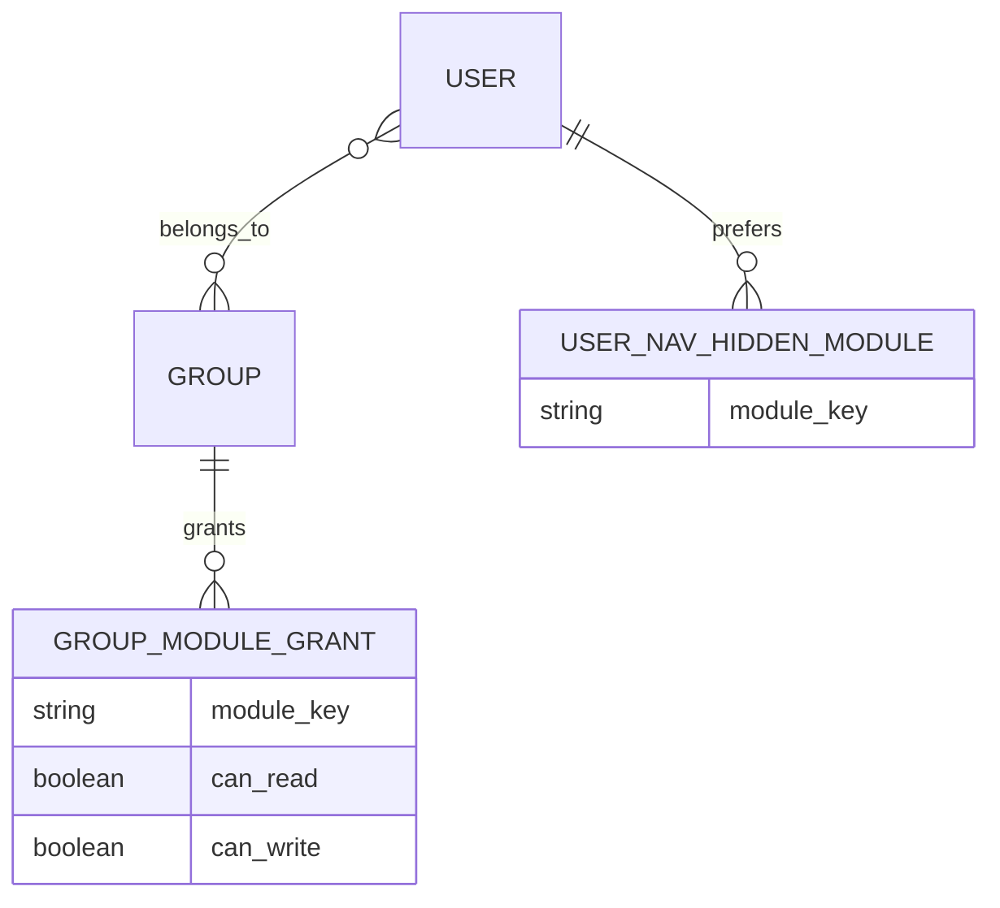
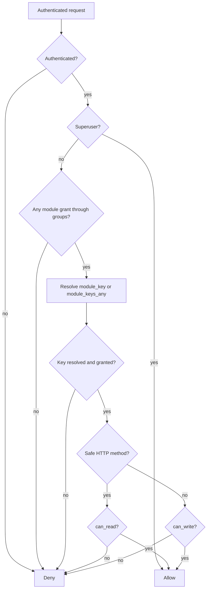
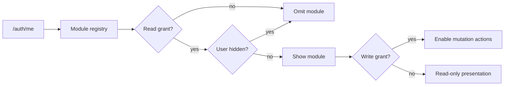

# Role-Based Access Control

PAD Platform authorizes API access by stable module key. Django groups are roles, group grants carry read/write rights, and the backend checks every protected view. The frontend consumes the effective access map to shape navigation and actions, but it is not the security boundary.

## Data model



`GroupModuleGrant` is unique per group and module key. If a user belongs to multiple groups, access is OR-merged independently for read and write: a grant from any group contributes that capability.

`UserNavHiddenModule` means “do not show this module in my navigation.” It never cancels a grant and never authorizes an API request.

## Permission evaluation

`ModuleRBACPermission` applies this algorithm:



- `GET`, `HEAD`, and `OPTIONS` require read.
- Mutating methods require write.
- Views normally declare `module_key` or implement `get_module_key()` for runtime resources.
- A view may declare `module_keys_any` when any of several modules legitimately authorizes the action.
- Object permission delegates to the same module-level decision; domain querysets/actions may add their own object filtering or invariants.

Missing module identity fails closed.

## Stable module keys

The backend registry lists every static grantable module. Examples include `products`, `pricing-rules`, `market-monitoring`, `export-runs`, `users`, and `history-explorer`.

Dynamic custom entities use `custom-data-{code}`. Grant validation checks that the entity definition currently exists and is not deleted. A label, navigation group, or frontend route can change without changing the permission key.

The access-matrix registry also declares whether a module supports write. Operational result resources such as some run/error feeds can be read-only in the matrix even though they have a stable key.

## Role and grant administration

The access UI reads the grouped module registry and writes grant rows for a role. Administration endpoints are themselves protected:

- user CRUD uses the `users` key;
- role/group CRUD uses `groups`;
- the permission matrix and bulk grant operations use `users-matrix`;
- permission catalog reads use their declared administration key.

Bootstrap creates an administrative role/grant baseline through the backend registry rather than a separate handwritten module list.

## Current-user contract

`/auth/me` returns the user identity plus:

```json
{
  "module_access": {
    "products": {"read": true, "write": false},
    "import-runs": {"read": true, "write": true}
  },
  "hidden_nav_modules": ["import-runs"]
}
```

The access map is the backend's effective merged result. The frontend does not reconstruct group membership or grant precedence.

## Frontend behavior



The UI uses access to remove inaccessible navigation, mark modules read-only, and suppress invalid actions. Direct URL entry is still checked by the backend. A hidden module may still be reachable by a direct route if the user has permission.

## History and deletion administration

- Global history requires read access to `history-explorer`.
- Entity and record history resolve the module key of that resource.
- Deleted/restore/purge administration endpoints require superuser status in addition to normal authentication; they are intentionally stronger than a module write grant.

## Adding a protected resource

1. Choose a stable, descriptive module key.
2. Add it to the backend static registry, or use the custom-data dynamic convention.
3. Set `module_key`, `get_module_key()`, or a justified `module_keys_any` on every API view/action boundary.
4. Use the same key (or explicit `rbacKey`) in the frontend module definition.
5. Expose the intended role-matrix label/group and write capability.
6. Test unauthenticated, no-grant, read-only, write, multiple-group merge, and superuser cases.
7. Test direct URL/API access; do not rely on hidden navigation.

## Diagnosing access

| Symptom | Check |
| --- | --- |
| Module absent for one user | `/auth/me.module_access`, then `hidden_nav_modules` |
| Visible but create/edit disabled | Effective `write` grant and module `supports_write` |
| API returns forbidden although UI shows module | View's backend `module_key` versus frontend `rbacKey`, then token/current-user freshness |
| Module missing from access matrix | Static registry definition or active custom entity definition |
| User has unexpected access | All Django groups and their OR-merged grants |
| Non-superuser cannot restore/purge | Expected: deletion administration is superuser-only |
