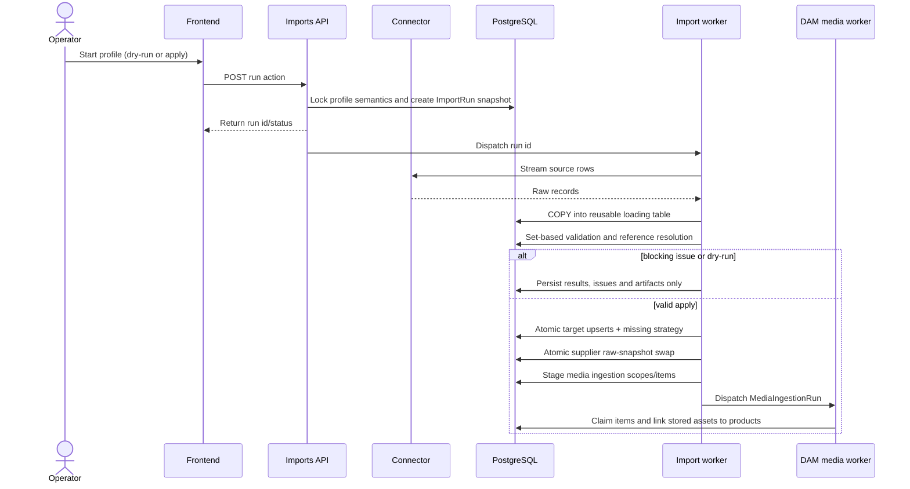
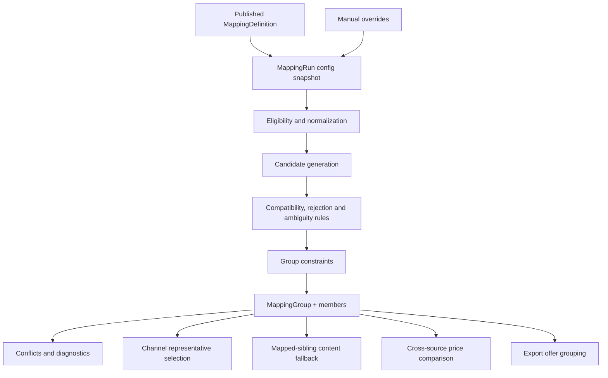
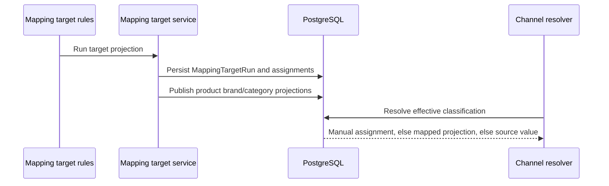
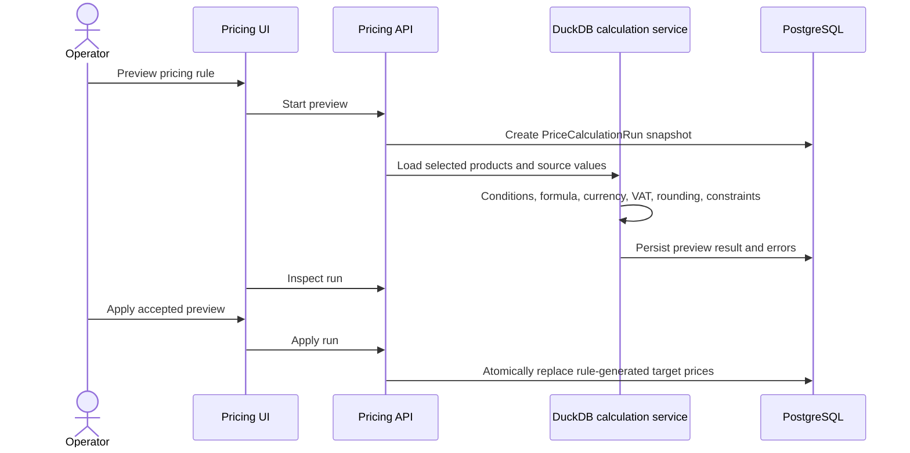
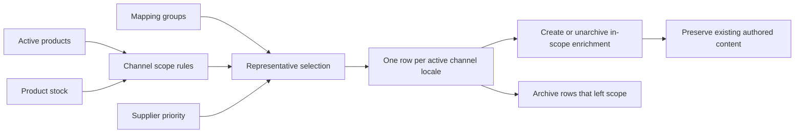
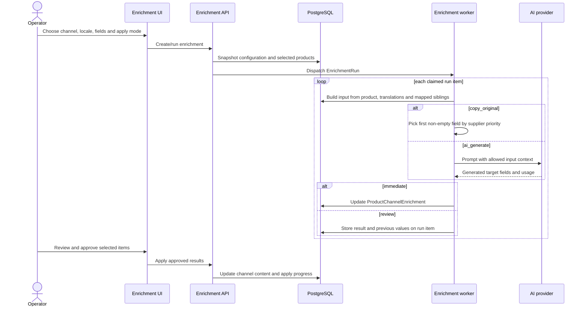
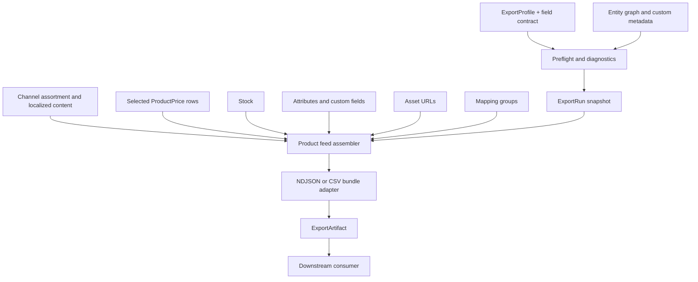
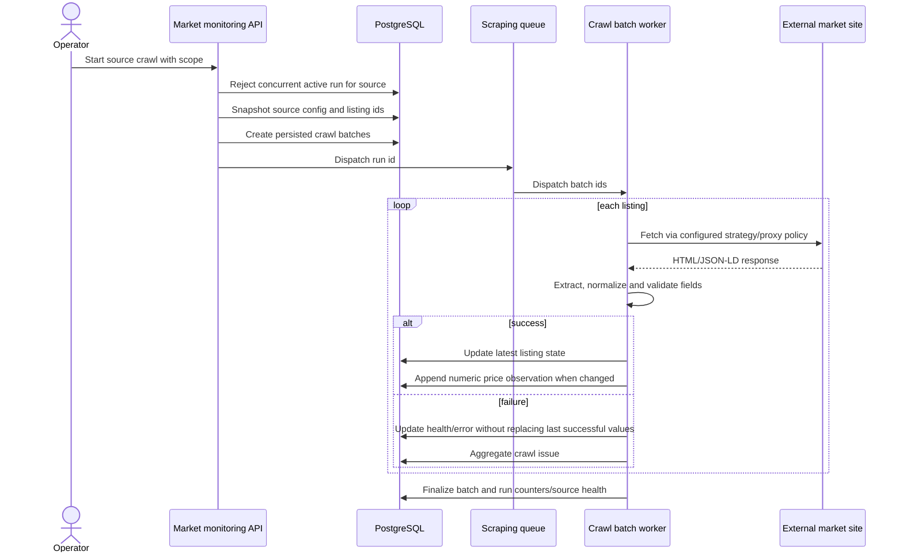
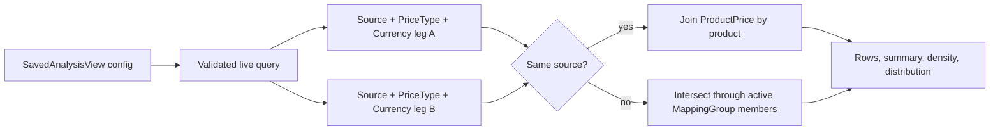
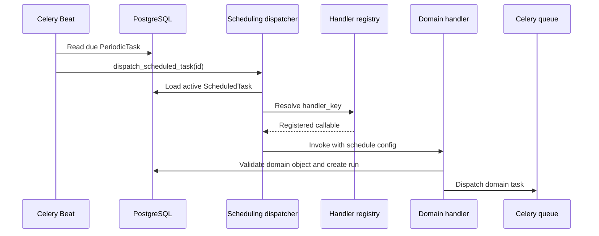

# Runtime Data Flows

This page traces the workflows that cross multiple applications. Start with the relevant run record, then follow its snapshot, work items, issues, and outputs.

## 1. Supplier import to catalog and assets

### Important contracts

- The connection owns access technology and secrets; the supplier feed owns stable source dataset identity; the import profile owns field-level transformation.
- Identifiers must resolve to real target uniqueness constraints so set-based upserts remain deterministic.
- Supplier mode preserves the previous raw snapshot until the new run completes successfully.
- Dry-run executes extraction, preprocessing, loading, dependency planning, and validation but does not modify business rows or swap the snapshot.
- Media ingestion is a post-import stage. A successful catalog transaction is not held open while remote files download.

### Data produced

The import may write system catalog tables, custom-entity rows, and supported M2M junctions. Operational evidence remains on `ImportRun`, target results, issues, and artifacts. Product media mappings may produce a linked `MediaIngestionRun` whose items lead to `Asset` and `ProductAsset` records.

## 2. Cross-source identity resolution

The definition is reusable configuration; the run is the reproducible execution. The result groups existing source products. Downstream apps query the active/published result associated with the mapping definition they are configured to use.

Manual positive links force allowed equivalence, negative links prevent it, and exclusions remove records from automatic participation. The mapping app owns precedence and consistency of those decisions.

## 3. Classification target publication

Identity grouping and classification normalization are distinct flows.

This precedence lets operators override individual values without discarding automatic projections or source truth.

## 4. Pricing preview and apply

Preview and apply are deliberately separate. A run records which rule configuration and input context produced the proposed values. Apply operates from that persisted result, not from a silently changed rule.

`ProductPrice` remains the common read model for channel exports and analytics regardless of whether a value was manual, imported, or calculated.

## 5. Channel assortment synchronization

The channel never duplicates an entire catalog. Synchronization materializes only the per-product, per-channel, per-locale content rows required for publication. A mapping group contributes at most one representative product according to channel priority and current eligibility.

## 6. Channel content copy and AI enrichment

The target is always channel-localized content. Base catalog data and translations provide input but are not overwritten by enrichment. Run items preserve inputs, outputs, previous values, errors, and provider usage so review and audit have the full context.

## 7. Product feed export

Preflight resolves the profile's selected fields against the current available/required contract before expensive assembly begins. The run persists diagnostics and configuration so an artifact can be explained later.

Generic entity export takes a parallel but simpler path: entity graph → validated field/filter/order selection → streamed flat CSV.

## 8. Market crawl

Listing ids are fixed when a run is created, so later listing edits do not change the workset in flight. One source cannot have two pending/running crawl runs. Browser and stealth work remains isolated on the scraping runtime.

## 9. Price analytics

Saved views preserve query intent, not stale result sets. The result reflects current catalog, mapping, and price data when the analysis runs.

## 10. Scheduled execution and queue routing

Queue routing is centralized in backend settings:

| Queue | Work |
| --- | --- |
| default | General scheduled handlers, imports, exports, pricing, apply/orchestration work |
| `enrichment` | `execute_enrichment_run_task` |
| `media` | `process_ingestion_run_task` |
| `scraping` | Market crawl run and batch tasks |

Handler keys are stable database configuration. Celery task names and queue routing are execution infrastructure. Keeping them separate lets deployments change worker topology without rewriting schedule records.

## How to trace a running operation

1. Locate the domain run record and confirm its status, trigger, timestamps, and configuration snapshot.
2. Compare total/processed/succeeded/failed counters with child item or batch states.
3. Inspect grouped issues first, then sample record-level issues/items.
4. Confirm the expected queue and worker processed the task name.
5. Inspect output rows or artifacts only after the run reaches its final state.
6. Use [History](./history) for user/domain edits; use domain run issues and snapshots for bulk-engine diagnostics.
