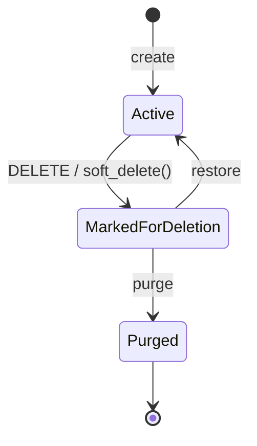
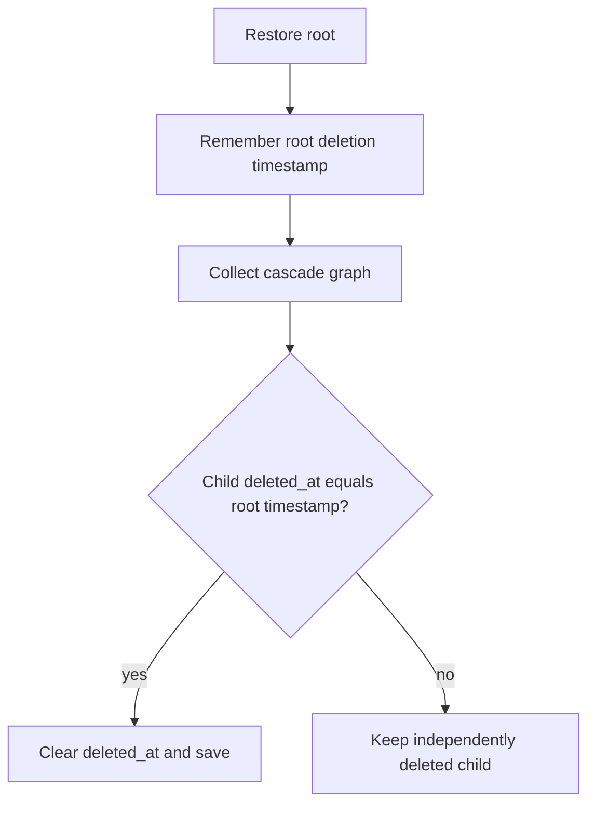
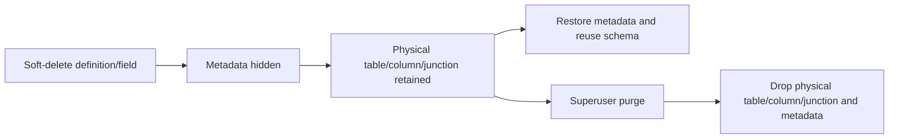

# Soft Delete, Restore, and Purge

Most PAD domain records use a recoverable deletion lifecycle. An ordinary DELETE marks `deleted_at`; default queries hide the row; a superuser can inspect and restore it. Purge is the separate physical-deletion operation.

## Lifecycle

| State | `deleted_at` | Default `objects` manager | `all_objects` manager | Recoverable through restore |
| --- | --- | --- | --- | --- |
| Active | `NULL` | Visible | Visible | Not applicable |
| Marked for deletion | Timestamp | Hidden | Visible | Yes |
| Purged | Row absent | Absent | Absent | No |

`BaseModel` supplies this contract. APIs inherit it through `CoreModelViewSet` and the deletion administration mixin.

## Ordinary API deletion

`CoreModelViewSet.perform_destroy()` calls `soft_delete()` when available. `BaseModel.soft_delete()`:

1. uses Django's deletion `Collector` to discover records that a normal delete would cascade to;
2. assigns one timestamp to the root and soft-deletable cascade descendants;
3. saves each record individually so model history records every change;
4. leaves protected relations intact and surfaces the database/domain conflict instead of bypassing protection.

Normal list/detail querysets use `objects`, so a deleted row disappears from ordinary API results immediately without losing its data.

## Restore semantics

`restore()` clears the root `deleted_at` and restores cascade descendants only when their deletion timestamp exactly equals the root's timestamp. This prevents restore from reviving a child that had been independently deleted before the parent operation.

Each restored record is saved individually, updates `updated_at`, and produces a history revision.

## Administration actions

Resources using `MarkedForDeletionAdminMixin` expose:

| Action | Method and suffix | Behavior |
| --- | --- | --- |
| List deleted | `GET .../deleted/` | Paginated deleted queryset |
| Restore one | `POST .../{id}/restore/` | Recover root and matching cascade |
| Purge one | `POST .../{id}/purge/` | Permanently remove one deleted record |
| Restore all | `POST .../restore-all/` | Apply resource-specific restore to every deleted row |
| Purge all | `POST .../purge-all/` | Apply resource-specific physical purge to every deleted row |

All five actions require superuser status. A module write grant alone does not authorize deletion administration.

## Purge

Purge invokes the resource's physical deletion behavior and cannot be reversed through PAD. Ordinary migration-backed resources use hard delete and database cascade/protection semantics. Apps override `perform_purge()` when physical storage requires more work.

Use ordinary DELETE for user workflows and purge only when the intent is to remove the retained row/schema permanently.

## Custom entity definitions and fields

Custom schema metadata needs special lifecycle behavior:

- Soft-deleting an `EntityDefinition` keeps its data and history tables.
- Soft-deleting a custom entity field or system custom field keeps the physical column/junction.
- Reusing the same code while a definition is deleted is rejected with an instruction to restore it; this protects the retained schema identity.
- Restore reactivates the metadata and existing physical storage.
- Purging an entity drops its data/history/junction schema and hard-deletes metadata after dependency checks.
- Purging a field drops the column or junction table and removes its metadata.
- Dynamic data rows themselves use `deleted_at`; row purge physically deletes after domain protection checks.

## History interaction

Soft delete and restore are updates, so their revisions show `deleted_at` becoming populated or cleared. Record-history lookup uses `all_objects`, allowing the history endpoint to find a marked-for-deletion row.

Purge is physical removal. Use history and domain run evidence before purge when an audit trail must be preserved outside the row's lifecycle.

## Relations and conflicts

| Relation behavior | Soft-delete result |
| --- | --- |
| `CASCADE` to another soft-deletable BaseModel | Descendant receives the same deletion timestamp |
| `PROTECT` | Operation is rejected; protected related data is preserved |
| `SET_NULL` or other database behavior | Applied according to the model relation and owning service |
| Custom schema dependency | App-specific purge checks prevent dropping schema still referenced elsewhere |

## Engineering rules

- Use `objects` for normal business queries and `all_objects` only when lifecycle administration or history explicitly needs deleted rows.
- Do not bypass `soft_delete()` with queryset hard deletes in ordinary resource workflows.
- Preserve the shared timestamp rule when implementing custom cascade restore.
- Implement app-specific purge for external files, dynamic schema, or protected cross-domain references.
- Keep restore/purge endpoints superuser-only unless the platform's security model is deliberately changed everywhere.
- Test active list visibility, deleted list visibility, history revision, cascade timestamp matching, protection conflicts, restore, and physical purge.
