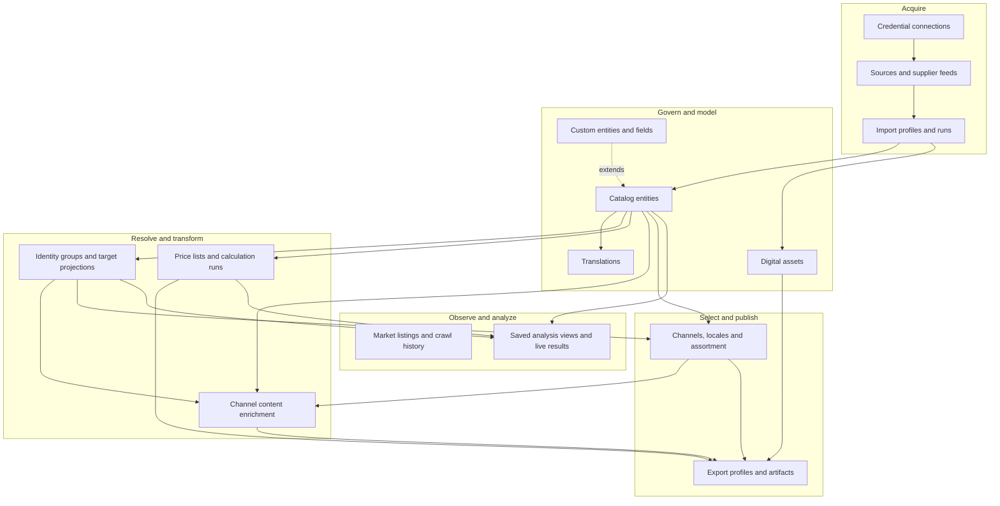
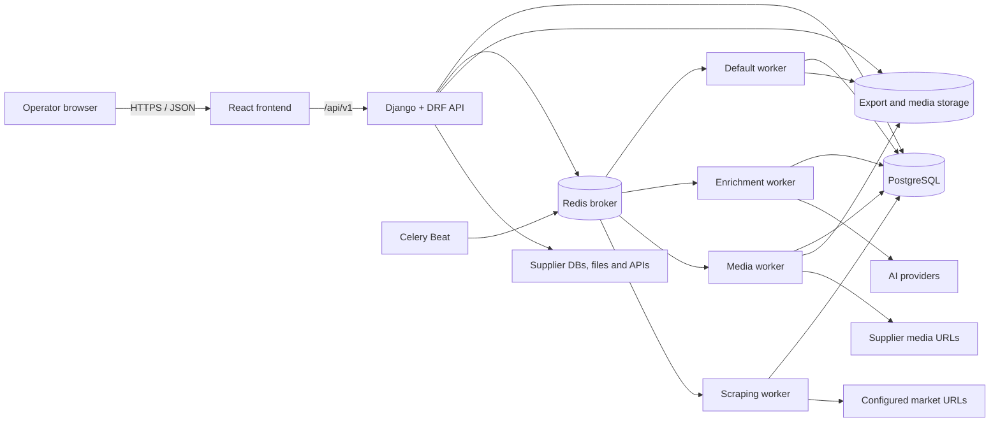
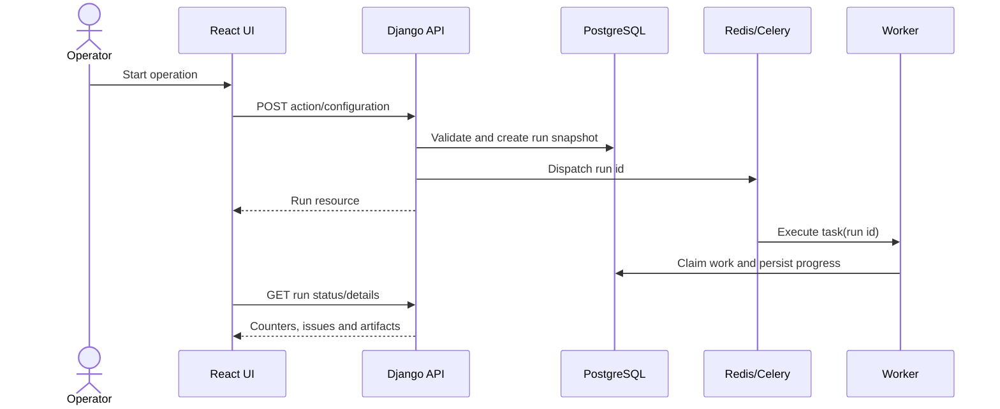

# System Overview

PAD Platform is a modular product data automation platform for ecommerce operations. It ingests source data, maintains a source-aware catalog, resolves equivalent records, calculates commercial data, prepares channel-specific content, and delivers export artifacts. The React application is the operational interface; the Django API and its background workers own business behavior and persistence.

## Product responsibilities

The platform owns five connected concerns:

1. **Acquire data:** connect to supplier databases or files, preserve source identity, validate rows, and import them at high volume.
2. **Model the catalog:** manage products, product models, classifications, attributes, stock, translations, assets, and customer-defined entities or fields.
3. **Resolve and transform:** group equivalent source records, project normalized classifications, calculate prices, and create channel-specific copy.
4. **Observe:** crawl configured market URLs and analyze prices across products and mapped sources.
5. **Publish:** select channel assortment and produce stable export artifacts for downstream systems.

It is not the public storefront runtime. It prepares and governs data that a storefront, marketplace integration, feed consumer, or another commerce system can use.

## End-to-end product pipeline

Arrows show the dominant business dependency, not every database relation. For example, exports also consult the entity graph and custom-field metadata, while every protected API uses users/RBAC.

## Runtime topology

### Runtime components

| Component | Responsibility | Durable state |
| --- | --- | --- |
| React frontend | Authentication flow, navigation, forms, generic CRUD, and custom workflow screens | Browser state and server cache only |
| Django API | Validation, authorization, orchestration, transactional domain changes, OpenAPI contract | PostgreSQL |
| PostgreSQL | System of record for catalog, configuration, runs, history, dynamic custom tables, and job schedule definitions | Database volumes/backups |
| Redis | Celery broker and task transport | Operational queue state |
| Celery Beat | Reads database schedules and publishes due tasks | Schedule definitions remain in PostgreSQL |
| Default worker | General imports, exports, pricing, and orchestration tasks | Run models and artifacts |
| Enrichment worker | AI generation runs isolated on the `enrichment` queue | Enrichment run items and channel content |
| Media worker | Asset download and ingestion on the `media` queue | DAM models plus local/S3 object storage |
| Scraping worker | HTTP/browser market crawling on the `scraping` queue | Listings, crawl runs, price observations, and issues |

The scraping worker is optional for installations that do not use market monitoring. Its image/runtime includes browser capabilities used by browser and stealth fetch strategies.

## Data categories

Understanding which kind of data a table holds makes the rest of the design easier to follow.

| Category | Examples | Update pattern |
| --- | --- | --- |
| Domain data | Products, categories, attributes, prices, channel content, assets | User changes and transactional workflows |
| Configuration metadata | Import profiles, mapping definitions, pricing rules, channel setup, enrichment configurations | Edited deliberately; copied into run snapshots where reproducibility matters |
| Operational runs | ImportRun, MappingRun, PriceCalculationRun, EnrichmentRun, ExportRun, MarketCrawlRun | Append-oriented execution records with counters, status, diagnostics, and timestamps |
| Audit data | Model history, dynamic-row history, M2M snapshots, price observations | Written alongside meaningful changes or observations |
| Dynamic schema | Custom entity tables, custom fields on system tables, M2M junction tables | Managed through validated PostgreSQL DDL |
| Artifacts | Export files and DAM objects | Filesystem or S3-backed storage referenced by database records |

## Synchronous and asynchronous work

Normal resource reads and edits are synchronous HTTP requests. Expensive or long-running operations create a durable run record first and execute through Celery. The UI polls or refreshes run state instead of holding an HTTP connection open.

## Cross-cutting platform contracts

| Contract | Purpose | Detailed page |
| --- | --- | --- |
| Module key | Stable authorization and frontend module identity | [Module Registry](./module-registry), [RBAC](./rbac) |
| Entity graph | Runtime metadata for entities, fields, relations, paths, and capabilities | [Entity Graph](./entity-graph) |
| OpenAPI document | Committed HTTP contract between backend and frontend | [Backend Architecture](./backend-architecture) |
| Base model behavior | Timestamps, soft delete, restore/purge, and model history | [Soft Delete](./soft-delete), [History](./history) |
| Run snapshot | Reproducible execution input for long-running workflows | [Runtime Data Flows](./runtime-data-flows) |
| Scheduling handler key | Stable indirection between database schedules and domain handlers | [Backend Applications](./backend-applications#scheduling) |

## Application boundaries

The backend is split into 19 Django applications. Each app owns a coherent domain or a shared platform mechanism; cross-app workflows are implemented by explicit services and foreign-key/metadata contracts. See [Backend Applications](./backend-applications) for the complete ownership catalog and dependency map.

The frontend uses 17 feature modules plus app-level routing, navigation, providers, and shared infrastructure. Static module manifests and backend-discovered custom entities are merged at runtime. See [Frontend Architecture](./frontend-architecture).

## Where to go next

- Read [Domain Model](./domain-model) for the vocabulary behind products, mappings, channels, and runs.
- Read [Runtime Data Flows](./runtime-data-flows) to follow the main workflows across applications.
- Use [Backend Applications](./backend-applications) to find code ownership before implementing a change.
