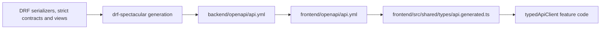

# API Schema Synchronization

The backend's executable serializers/views define runtime behavior. The committed backend OpenAPI document is the shared transport contract, and the frontend-generated TypeScript file is derived from it.



## Backend contract change

1. Define normal request/response shapes with DRF serializers.
2. Add `extend_schema` for custom actions whose request or response differs from the viewset serializer; use `request=None` for bodyless actions.
3. Represent structured JSON/DSL values with strict domain serializers used by both runtime validation and schema generation.
4. Keep shared choices/operators in domain constants imported by serializers, validators, parsers, and metadata endpoints.
5. Return failures through the shared Problem Details handler.
6. Generate and validate from `backend/`:

```bash
uv run python manage.py spectacular --file openapi/api.yml --validate --fail-on-warn
```

Inspect the contract diff. A schema change is part of the backend change and must be reviewed like code.

## Frontend synchronization

From `frontend/`:

```bash
pnpm api:sync
pnpm check:api-types
pnpm build
```

`api:sync` copies `../backend/openapi/api.yml` into `frontend/openapi/api.yml` and runs `openapi-typescript` to regenerate `src/shared/types/api.generated.ts`. `BAS_OPENAPI_SOURCE` may override the source path for an alternate workspace layout.

Neither generated file is edited manually. `check:api-types` regenerates in check mode and fails when the committed TypeScript output is stale.

## Frontend consumption

Feature code calls `typedApiClient` with a generated path template and explicit path/query/body values. Request/response aliases come from `api.generated.ts`.

Registry-driven custom-entity URLs and binary downloads use the centralized `dynamicApiClient` boundary because their URLs cannot be enumerated as static OpenAPI paths. Feature modules never import Axios directly.

Frontend-only form/view state may be handwritten when it intentionally differs from transport data. Convert it at the API boundary and let the generated request type validate the conversion.

## Breaking changes

Treat a removed/renamed field, stricter requirement, changed enum, path change, or response-shape change as one coordinated backend/frontend change:

1. update backend runtime and schema;
2. regenerate the committed backend document;
3. synchronize/regenerate frontend types;
4. update all compile errors and feature behavior;
5. run backend tests plus frontend API-type, lint, and build checks.

The change is incomplete if runtime code, committed OpenAPI, the frontend copy, and generated TypeScript types do not describe the same contract.

