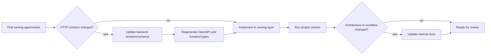

# Engineering Guide

This section turns the architecture model into a safe development workflow. Start with the architecture before making changes that cross applications.

## Recommended onboarding path

1. Read [System Overview](../architecture/system-overview) and [Domain Model](../architecture/domain-model).
2. Use [Backend Applications](../architecture/backend-applications) to identify the owner of the behavior you are changing.
3. Follow one representative operation in [Runtime Data Flows](../architecture/runtime-data-flows).
4. Set up the relevant project using [Backend Development](./backend-development) or [Frontend Development](./frontend-development).
5. Read the closest project/app `AGENTS.md` before editing code.
6. If the HTTP contract changes, complete [API Schema Synchronization](./api-sync) before considering the change finished.

## Project boundaries

| Project | Change belongs here when... | Primary checks |
| --- | --- | --- |
| `backend` | It changes domain data, validation, permissions, asynchronous execution, imports, calculations, or API behavior | Ruff, Django checks, pytest, OpenAPI generation |
| `frontend` | It changes operator interaction, navigation, forms, tables, visualization, or client-side state | API type check, ESLint, TypeScript/Vite build |
| `docs` | It changes customer guidance, internal architecture, engineering procedures, or operational knowledge | Typecheck, public build/privacy check, internal build |

The backend owns transport validation and business rules. The frontend owns presentation and interaction, consumes generated transport types, and must not recreate backend DTOs manually.

## Change workflow

## Stable engineering rules

- Put reusable business behavior in the owning backend service, not in a view, task, or sibling app.
- Keep Celery tasks thin and pass durable identifiers rather than serialized domain objects.
- Use database constraints for invariants that must survive every write path.
- Use generated OpenAPI types and centralized API clients in frontend feature code.
- Keep user-facing navigation in the navigation schema and routable feature metadata in module manifests.
- Add tests for the lowest useful layer and for authorization/lifecycle behavior at the API boundary.
- Update the architecture catalog when an app's ownership, dependency, or runtime flow changes.

## Sources of detailed rules

- Root `AGENTS.md`: repository-wide project boundaries and API-contract rules.
- `backend/AGENTS.md` and nested app instructions: backend invariants and app-specific architecture.
- `frontend/AGENTS.md`: generated types, navigation, module registry, and shortcut contracts.
- `docs/AGENTS.md`: public/internal publishing separation and architecture-document conventions.

