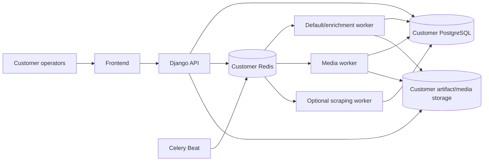

# Deployment Model

PAD Platform uses a **single-tenant application model**: one customer receives one isolated platform installation and database while all installations are built from the same product codebase and release process.

## Supported delivery shapes

| Shape | Ownership | Isolation |
| --- | --- | --- |
| Managed single-tenant | PAD team operates the installation on managed infrastructure | Dedicated application runtime, database, queue, storage, configuration, and secrets per customer |
| Enterprise on-premise | Customer infrastructure runs a packaged PAD release under the agreed support model | Dedicated customer environment; the same runtime contracts apply inside their boundary |

Customer-specific product behavior belongs in explicit configuration or an agreed project fork, not in shared database rows for unrelated tenants.

## Installation topology

Every installation includes the frontend, API, PostgreSQL, Redis, default application worker, media worker, and scheduler. The browser-capable scraping worker is enabled when market monitoring is used. DAM objects can use S3-compatible storage; export artifacts and media references remain owned by that installation.

## Release invariants

- Application containers for API, default worker, media worker, and Beat run the same backend code revision.
- Database migrations complete before the new API serves traffic that depends on them.
- `sync_scheduled_tasks` reconciles PAD schedule definitions with database-backed Celery Beat tasks.
- Worker queue routing matches the backend task routes: default, `enrichment`, `media`, and optional `scraping`.
- Frontend and backend releases use the same committed OpenAPI contract.
- Customer configuration and secrets are injected per installation and are not committed into the product codebase.
- Database and artifact/media storage are isolated per customer installation.

## Local Compose relationship

`backend/docker-compose.yml` includes `docker-compose.dev.yml` and is the development realization of the same component topology. It starts PostgreSQL, Redis, Django, workers, Beat, and local database tooling; the optional `scraping` profile adds the browser runtime.

Production or customer infrastructure may use a different orchestrator, reverse proxy, secret store, database service, and object storage. Those choices do not change the application-level contracts documented in [System Overview](../architecture/system-overview) and [Runtime Data Flows](../architecture/runtime-data-flows).
