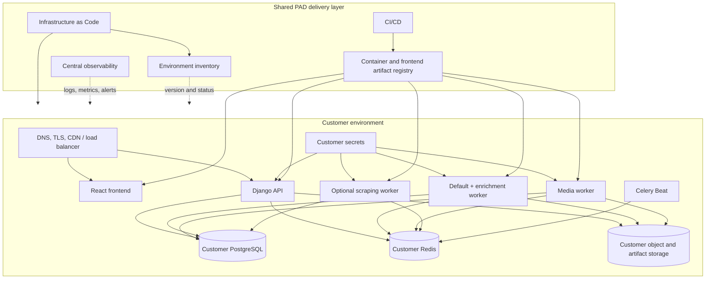
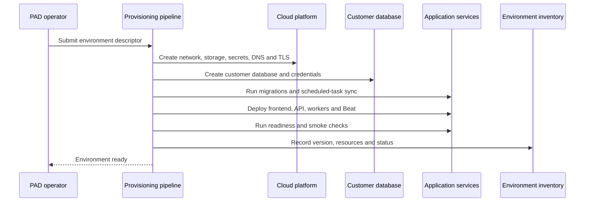

# Proposed Deployment Architecture

:::warning Proposed design

This page documents the production implementation currently under
consideration. It is not yet an approved architecture decision or a production
service guarantee.

:::

## Goals

The deployment design should make a new customer environment repeatable rather
than a manually configured server:

- one isolated application environment per customer;
- one shared PAD codebase and release process;
- immutable application artifacts reused across customers;
- automated provisioning from a versioned environment definition;
- independent customer data, credentials, configuration, and lifecycle;
- centralized visibility into versions, health, backups, and upgrades;
- a path to customer-hosted delivery without maintaining another application
  architecture.

An isolated environment does not require a dedicated physical server. Several
customer environments may use the same managed cloud control plane and compute
platform while keeping their application processes and data boundaries
separate.

## Proposed operating model

The implementation separates a shared PAD delivery layer from customer data
planes.



The shared layer contains no customer catalog data. It distributes product
artifacts, creates environments, and records operational metadata.

## Customer isolation

The proposed baseline isolates the following resources:

| Resource | Proposed boundary |
| --- | --- |
| PostgreSQL | Separate customer database and credentials; a dedicated managed cluster may be used for higher isolation or capacity tiers |
| Application runtime | Separate API, worker, and scheduler service definitions with customer-specific configuration |
| Secrets | Separate secret namespace and encryption keys or key references |
| Object and artifact storage | Separate bucket or strongly isolated customer prefix with customer-scoped access policies |
| Redis | Customer-specific broker/result-backend boundary; physical sharing is only acceptable when namespaces, credentials, limits, and failure impact are proven isolated |
| Network | Customer services are private by default; only the frontend and API edge are public |
| DNS and TLS | Customer-specific domain and certificate |
| Logs and metrics | Customer identity attached to operational telemetry, with access controls preventing cross-customer visibility |

The product has no application-level tenant router or tenant key in its domain
model. A running API and its workers therefore use one customer database
configuration.

## Application runtime

### Frontend

The React application is built as a versioned static artifact. The preferred
production shape serves it through a CDN or web server and routes `/api` on the
same customer domain to the matching backend. This allows one frontend artifact
to be reused without embedding a different API URL into every build.

### API

The Django API runs as an immutable container behind a managed load balancer or
reverse proxy. Production uses a WSGI or ASGI application server rather than
Django `runserver`.

The API container is stateless apart from temporary working files. Persistent
data belongs in PostgreSQL or durable object/artifact storage.

### Workers

The backend release produces runtime images for:

- the API;
- the default and enrichment Celery queues;
- the media queue;
- the optional Chromium-enabled scraping queue;
- Celery Beat.

API, workers, and Beat for one customer run the same backend release. Worker
types scale independently because HTTP traffic, enrichment, media ingestion,
and browser scraping have different resource profiles.

Exactly one effective Celery Beat scheduler runs per customer environment.

### Database migrations

Database migrations run as a dedicated release job before application services
depend on the new schema. They do not run concurrently in every API replica.
Schema-changing releases use backward-compatible rollout steps where possible.

`sync_scheduled_tasks` runs as a controlled post-migration step to reconcile
PAD schedule definitions with database-backed Celery Beat records.

## Data and storage

PostgreSQL remains the system of record. The production database service
provides encryption, automated backups, point-in-time recovery, monitoring, and
capacity controls.

DAM already supports S3-compatible object storage. Production uses object
storage rather than container-local media directories.

Exports and import staging currently use filesystem paths. Before horizontal
scaling, these paths must either:

- move to object-storage-backed adapters; or
- use explicitly provisioned shared durable storage with lifecycle and backup
  policies.

Temporary processing files remain ephemeral and are deleted after the owning
job completes.

## Managed hosting baseline

The initial managed deployment under consideration uses:

- one primary cloud provider and a small number of required regions;
- managed container compute for API and worker services;
- managed PostgreSQL;
- managed Redis;
- S3-compatible object storage;
- managed DNS, TLS, CDN, and load balancing;
- a managed secret store or KMS;
- centralized logs, metrics, dashboards, and alerting;
- Infrastructure as Code for all customer resources.

The initial design avoids operating a Kubernetes cluster unless portability,
policy, customer-hosted packaging, or workload scale creates a concrete need
for it.

## Environment definition

Every installation is described by a versioned, non-secret environment
descriptor. It contains values such as:

```yaml
customer: example
domain: pad.example.com
region: eu
size: standard
release: 1.0.0
features:
  scraping: false
retention:
  history_days: 90
```

Secrets are referenced from the deployment platform's secret store and are
never committed to the descriptor.

The environment inventory records at least:

- customer and environment identity;
- domain and region;
- deployed frontend and backend versions;
- database and storage references;
- enabled optional runtimes;
- health and last successful deployment;
- backup and restore-test status;
- pending upgrade state.

## Provisioning flow



The provisioning workflow is idempotent: applying the same descriptor
reconciles the environment rather than creating duplicate resources.

## Release flow

1. Backend and frontend tests validate the release and OpenAPI contract.
2. CI builds immutable, versioned artifacts once.
3. Artifacts are scanned and published to the shared registry.
4. A non-production customer-shaped environment receives the release first.
5. A release job runs database migrations and schedule reconciliation.
6. API, workers, Beat, and frontend are updated to compatible versions.
7. Readiness, API smoke, queue, storage, and scheduled-job checks run.
8. The environment inventory records the deployment result.
9. The release is promoted to customer environments in controlled waves.

Application rollback uses the previous immutable artifacts. Database changes
need an explicit forward-fix or rollback procedure and must not assume that
restoring an old container automatically restores an old schema.

## Backups and recovery

The proposed customer environment backs up:

- PostgreSQL, including point-in-time recovery where supported;
- DAM objects and non-reproducible export/import artifacts;
- environment configuration and infrastructure state;
- encryption-key references and secret-recovery metadata through the selected
  secret-management process.

Recovery is verified through scheduled restore tests into an isolated
environment. Soft delete and model history support user recovery but do not
replace infrastructure backups.

## Observability

Every environment emits customer-scoped:

- API request rate, latency, and error metrics;
- database availability, connections, storage, and saturation;
- Redis availability and queue depth;
- worker activity, retries, failures, and stuck-run signals;
- scheduler heartbeat and scheduled-task drift;
- object-storage and export failures;
- release version and deployment events.

Operational telemetry is centralized, while access controls and data
redaction prevent one customer's information from appearing in another
customer's views.

## Customer-hosted variation

Customer-hosted delivery reuses the same OCI images, commands, configuration
contract, migration flow, and health checks. It is packaged as a versioned
deployment bundle for the supported target rather than as a copy of the local
development Compose stack.

The customer-hosted package supplies:

- runtime manifests;
- required PostgreSQL, Redis, object-storage, ingress, DNS, and TLS contracts;
- secret injection points;
- resource requirements;
- installation, upgrade, backup, restore, and diagnostics procedures;
- a compatibility matrix for supported infrastructure versions.

## Current production-readiness work

The repositories already provide the application topology, development
containers, environment-driven settings, tests, and a shared OpenAPI contract.
The proposed architecture still requires implementation work:

- replace Django `runserver` with a production WSGI or ASGI server;
- add a production frontend hosting artifact;
- create versioned production container definitions;
- move remaining persistent filesystem workflows to durable storage;
- add Infrastructure as Code and the environment inventory;
- build artifact publishing and deployment pipelines;
- separate migrations from API startup;
- add application readiness endpoints and smoke checks;
- configure production TLS, security headers, secrets, and network policies;
- add dependency, container, secret, and artifact scanning;
- implement centralized observability and incident alerts;
- implement backup, restore testing, release rollback, and disaster-recovery
  procedures.

`backend/docker-compose.yml` and `backend/docker-compose.dev.yml` remain local
development assets. They describe component relationships but are not the
production deployment package.

The application-level boundaries remain documented in
[System Overview](../architecture/system-overview) and
[Runtime Data Flows](../architecture/runtime-data-flows).
